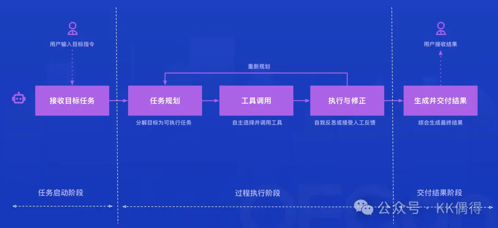

## Agent 产品设计原则
### **透明可解释**
 Agent的思考过程外显。如果Agent 得出一个结论，用户必须能看到背后的证据链和推导逻辑。
### 认知减负
- 懂得“自动建议”和“环境适配”。
- 应该自动读取上下文，不要让用户重复输入。
- 应该无缝嵌入用户原来的工具链中，而不是强迫用户在多个窗口来回切换。
### **人在环路**
- 要追求“可控的自主”。
- 用户必须始终掌握控制权。任务执行中，人可以随时暂停、修改和确认，或者仅仅是看着它执行。
- ==智能不是越自动越好，而是越可控越好。==
## 交互模式

### 任务启动：唤起 Agent、让他理解任务
- **针对上手和信任：统一入口与“示例生态”**
    - 案例：GenSpark & v0.app
        - 统一入口：一个清晰的输入框或指令区，让用户直接开始
        - 引导式提示：通过示例提示、推荐任务或引导语，降低使用焦虑
        - 多模态交互：支持文本、语音、文件、图片等方式输入
        - 可见的能力范围：在指令输入框在展示能力范围
        - 参考示例生态：展示案例或模板
- **针对唤起便捷性：环境适配与无缝融入**
    - 案例：Atlassian Rovo
        - 在右下角提供常驻的悬浮按钮
        - 在顶部提供统一的聊天入口
        - 在 IDE 中通过快捷指令内联调用，用于生成和修改内容
        - 通过浏览器插件将能力扩展到任何网页
        - 集成到更高频的应用中，如 IM
- **针对意图理解：就地澄清模式**
    - 案例：Gemini / ChatGPT / Unifunc DeepResearch
        - 自动澄清复杂目标：在执行前主动识别并澄清模糊或复合目标，让用户理解 Agent 如何解读任务意图
        - 支持就地修改：允许用户直接在生成的任务或计划中调整和确认细节，保持过程可控与灵活
        - 可见计划与确认节点：在执行前展示清晰的行动计划和确认步骤，让用户清楚 Agent 将做什么、为什么这么做
### 过程执行：推理、规划、调用工具、反思
- **针对透明度与上下文：思考外显与可视化路径**
    - 案例：Datadog Bits AI
        - 思考可视化路径：用图形化结构展示 Agent 的推理过程，让假设、验证与证据关系一目了然
        - 动态状态同步：让可视化图与对话实时联动，用户能随时看到思考进展与状态变化
        - 分阶段总结：在每轮推理或验证后生成阶段性结论，帮助用户快速把握当前进展
    - 案例：CICDAgent / Augment
        - 可视化上下文展示：将已采集的上下文、数据与知识结构化呈现，让用户直观看到 Agent 的“思考依据”
        - 一键解释机制：每个上下文元素可点击查看“为什么需要它”，帮助用户理解决策逻辑，提升透明度
        - 用户可控编辑：允许用户直接添加、删除或替换上下文内容，确保给出的上下文更精准
        - 变更可追溯：所有上下文调整都有记录，保证过程可审计、可回溯
- **Agent 思考主线：假设-证据循环：**
    - 生成假设：
    - 为每条假设选工具
    - 证据打分与收敛：归一化打分，给出 top-k 可能根因+置信度+证据链接
    - 生成下一步建议
    - 输出到协作流
- **针对安全边界：权限确认机制**
    - 案例：Kubiya AI
        - 操作可见化：在执行前以自然语言和结构化列表，清晰展示 Agent 将执行的具体操作、影响对象与作用范围；明确列出当前授权权限的动作与资源，显示“不包含的操作”，让用户对边界心里有数
        - 双重确认机制：提供“确认/拒绝”选项，并附带操作时效，降低误触与持久风险
        - 可回溯授权记录：所有授权操作自动记录，支持后续查看执行日志与权限使用明细，形成安全闭环
        - 安全解释语义化：用可读性强的语言解释技术权限，让普通用户能理解风险
- **针对可控性：暂停-反馈-继续**
    - 案例：GitLab Duo Workflow 和 Augment
        - 支持中途暂停与人工审阅：任务在关键节点可暂停，让用户先 review 再决定是否继续执行，确保安全与信任
        - 即时修改与重启机制：用户可在任务执行过程中直接添加新任务或删除任务，修改后可从当前节点继续执行而无需重跑
        - 实时反馈与任务日志：系统同步显示每一步执行状态与结果，让用户对进展与决策依据一目了然
        - 可视化任务状态面板：通过任务列表与进度条直观展示执行情况，让用户随时掌握 Agent 行为与控制点
### **结果交付：输出结果、修改、复用、版本管理**
- **针对质量自检：置信度标注与引用溯源**
    - 案例：Unifunc DeepResearch
        - 结果预览与问题标注：任务完成后自动展示结果预览，对潜在错误或不一致之处进行高亮标注
        - 事实与引用校验：标明每条引用或数据来源，区分可靠、可疑或缺失来源，让事实有据可依
        - 自动置信度提示：通过颜色或标签提示模型置信度，帮助用户聚焦高风险或需复核的内容
        - 一键复查与改进建议：允许用户触发或再验证或重新生成，Agent 给出改进方向并支持持续优化
- **针对无缝衔接：工作流集成**
    - 案例：Kubiya AI / Product Storymap
        - 无缝斜接工作流：任务结果可一键导出至常用工具（文档、任务系统、看板等），减少人工搬运
        - 可编辑可复用的结果结构：输出内容保持结构化，可直接修改或分块复用，避免重复生成
        - 快捷分发与协作：支持直接在聊天、文档或平台中分享结果，提升团队协作流转效率
        - 自动生成后续动作建议：Agent 主动识别结果的可延伸任务，推荐下一步操作或关联 Agent
- **针对版本管理：可视化对比与回滚**
    - 案例：v0.app / Augment
        - 自动生成版本快照：Agent 在关键步骤或用户确认节点自动保存版本，避免历史进度丢失
        - 可视化版本对比：支持文本、结构或界面差异对比，让用户一目了然的看到修改影响
        - 一键回滚与重用：允许用户快速恢复至任意版本，或复用旧版本内容到新任务中
        - 版本命名与备注机制：支持 Agent 自动生成摘要或用户自定义备注，方便识别与协作沟通