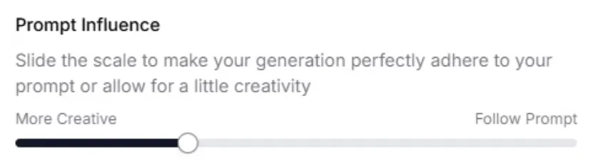
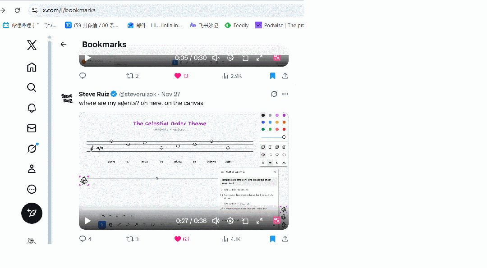

---
tags:
  - HITL
源地址: https://mp.weixin.qq.com/s/7_Kk2VeIcs3nJAUhf7ObwA
可发布: true
发布日期: 2025-12-11
---
## 产品设计的终极形态
> [!quote]
> 产品设计的核心工作：设计概念+系统级别交互
>  **Stewart Brand 的《How Buildings Learn: What Happens After They're Built》（建筑如何学习：建成之后发生了什么）**

未来的 UI 一定是千人千面的，产品最终长成什么样，会更多由用户自己的 taste 决定。
比如，未来开发、PM、设计师都会直接在 Cursor 里完成工作，只是他们看到的「界面形态」完全不同：有人直接操作画布，有人操作文档，有人操作代码。但这些角色本质都在做同一件事——影响一段代码如何被改动。
比如，notion 设计了 block、page 和 database，以及它们如何互相嵌套。
对比建筑的艺术：建筑是一个随着时间推移不断进化的有机体。优秀的建筑不是设计出来的，而是随着用户的需求生长出来的。

==产品设计的底层工作：==
> 在我设计的规则下，系统自己长出来的界面，十万个人用起来都顺手，各不相同但没有失控。> 
> 从建筑到软件，我们一路在讨论的，都是同一件事：**一个系统怎么在时间里变形，又怎么在变形中维持自己。**
> 任何一个有韧性的系统，都是由不同速度的层级叠加起来的。

1. **定结构：** Ta 要先搭一套清晰、耐用的概念体系，再规划一组可插拔的能力接口，最后给最外层留出足够的空间，让用户自己的 taste 和 workflow 能生长出来。
2. **定属性：** Ta 要看清每一块东西的本质属性（比如一个按钮、一个 workflow、一条用户权限、一种服务能力），然后决定哪些东西是底层共享的，哪些是可以个性化的。
3. **定逻辑：** Ta 要从设计「这个页面长什么样」，到设计「这个系统该如何思考」。
## 最好的 AI 交互设计
### 参数滑块
自然语言在描述「程度」时是无力的。你很难界定「放飞一点点」具体是多少。
很多 AI 产品现在都加上了参数滑块，比如 11 Labs 可以调整 Prompt Influence（提示词权重），决定是严格遵循指令，还是让 AI 自由发挥。

未来，==「Prompt 负责定性，滑块负责定量」==可能成为一个标配设计。
在做一个精细任务时，用户可以直接在旁边创建一个滑块，比如一端是更简洁，一端是更详尽，来回拖一拖，就能快速试出一个满意的区间。
同时，这在心理学层面也很重要。体验上的 Feedback Loop（实时反馈回路）才是让用户进入心流，感到满意和快乐的关键。
> [!quote]
> 交互设计师 Geoffrey Litt 在播客里讲过一个观点，现在很多 AI 工具都在追求极致的自动化（比如 Agent 一键做出一个完整的作品），但他认为这是非常反人性的，**完全由 AI 生成的内容，用户很难产生「这是我的作品」的归属感**。
### 反向 Onboarding
当前大多数产品的 onboarding，基本都是==用户一上来就要付出时间、信任，还不知道值不值得。==
而一些很妙的 Onboarding 案例，是把这个逻辑完全反过来。通过onboarding这个过程快速证明：「这是我能做到的，你先感受一下。」
比如 AdComposer.ai（一个广告文案生成工具），它的首屏极其克制，只有一个输入框：丢下你的公司网址，一键生成几组广告创意。
未来很多 AI 产品的第一步，都会变成先证明自己，先让用户看到价值，而不是一上来就要求用户先行付出。也就是说，有没有办法**把 TTV（Time to Value，价值感知时间）压到接近 0**，让用户第一次点进来，就像走进面包店门口，被塞了一块试吃的小饼干？
### 善用等待时间
现在的 AI 生成往往需要几十秒，用户对着 Loading 动画等待时会变得非常不耐烦。但 Gamma 和 Perplexity 提供了一个挺好的思路：
==等待时间，本质上是一个低成本的「二次交互窗口」。==
比如，Gamma 会在你盯着屏幕发呆时，让你选 PPT 的主题风格；Perplexity 在一些情况下会弹窗问你：「是否需要补充更多细节？」
这样，既给了用户事情做，模型的生成结果也更准，还减少了需要迭代的轮次，对公司是实打实的成本优化。
### 用「命名」控制用户预期
交互设计中，很重要的一个工作其实是「定义语言」。==团队选用的名词，决定了用户如何理解产品的边界。==
我自己超级喜欢的一个案例是一个画布产品 tldraw，他们尝试让 Agent 在画布上协作时，发现现在的模型还是很笨，经常把东西画错位置，或者不知道自己在干嘛。
那问题来了：要怎么让用户能试用起来，又不对它期待过高呢？
后来，他们搞了一套非常有意思的「叙事降级」策略，把幻觉本身，从产品缺陷，变成了世界观设定。成功是惊喜，翻车是剧情。
他们考虑的**名字**是 fairies（小精灵）/ ghosts（小鬼）/ bugs（小虫子）—— 听上去就不像能全权托付的对象。
- 你可以看到它在「思考」（摸下巴）；
- 看到它觉得任务太难了，开始召唤其他小精灵（sub-agent）来一起干活

**技术逻辑**也被包装成了童话隐喻：
- **池塘（Pond）= 文件夹/作用域**： 想要管理一个特定的上下文，只需要在画布上画一个魔法池塘。任何被拖进池塘的文件，就会自动成为这个 Agent 的 Context。
- **礼物（Gifts）= 补充信息**：想要给 Agent 额外的文档，可以像给精灵留下礼物一样，把小纸条留给它。
- **附身（Warging）= 外部工具调用**： 当一个小精灵需要通过 MCP 去连接外部工具或数据时，它的眼睛会翻白，像权游里的 warging，表示它正在通灵（所以延迟、卡顿都是合理的施法过程）。
这里的启发是，叙事设计可以是我们掩盖模型能力不足、提升用户留存一个很高效的手段。
==尤其在今天，AI 还有很多幻觉和 bug，你产品的「叙事包装」最好与 AI 呈现出的「智力水平」相匹配，而不是给它一个它撑不起来的广告语。==
### 视角滤镜
> [!quote]
> 交互设计师 Linus Lee，前 Notion 负责探索 AI 功能的设计。
> 每个创意行业大都存在一个资源库。比如字体库、音效库、滤镜库、笔刷库。但思考和写作还不存在这样的东西。
> 我们其实可以尝试**从模型里，提取出一种可打包、可共享的「思维特征」，把它们变成一种新的资源库，任何人都能随意取用。**

往后，也许在写作界面里，我们会看到一个「视角过滤器」菜单栏，和现在在 Word 里选字体一样方便。一个产品经理，可以装载一个「乔布斯思考滤镜」，让 AI 瞬间切换视角给出点评。
同时，大家也可以自己定制滤镜，并在公开市场上交易。 ==以前的知识付费卖的是内容，未来的知识付费卖的是「脑回路」。==
再往外推一步，==未来每家公司可能也都会有一个「品牌滤镜」。==
内置创始人人格特质、价值观，公司所有品牌物料等。所有对外邮件、文章、招聘都先跑一遍这个滤镜，检查「是否符合公司气质」。
把粒度再做细一点，AI 产品里还可以有一个「思维调音台」。 这里的交互就不是下拉菜单，而是一组推拉杆。
==只要创造思考中有哪一块是高频 + 可复用 + 创建门槛较高，都可以考虑一键封装，随时调用。==
## 软件民主化
未来的软件，更多会像快消品，它不再需要追求 SaaS 的高留存与高 LTV，而只需要在当下那一刻，解决你特定的问题。
就像视频从专业制作走向人人可拍，软件开发也将从全球「2000 万开发者」的特权，泛化为「80 亿创作者」的日常媒介。
### 全新的 GTM 模式：软件即内容 (Apps as Content)
- **新的商业模式**：一个抖音上的健身博主，未来最自然的变现方式，可能不是卖课，而是发 5 个 mini app，每个 app 对应一套训练方案。
- **新的流量入口**：以前博主会在小红书写一篇「东京只有本地人才知道的 10 家拉面店」，未来他可能直接发布一个「东京拉面杀手」 mini app，里面有一个极简地图，只标这 10 家店。
- **新的社区形态**：这些 mini app 本身会变成「社区启动器」。比如你做了一个「伦敦观鸟指南」app，用的人天然就是同好。以前做社区要靠内容、靠运营，未来可能只需要把一个 mini app 丢到网上，它自己吸人。
### 潜在问题：多少人有创作 App 的冲动？
> [!quote]
> 真正从零开始原创的人，永远不会超过 10%，但很多的人，都会参与修改和迭代。via. Replika CEO Kuyda

1. 直接 fork 别人的 App，在此基础上迭代
2. 给创作者提需求
也就是说，「软件民主化」的实际落地形态，不是人人都是开发者，而是人人都能参与迭代。