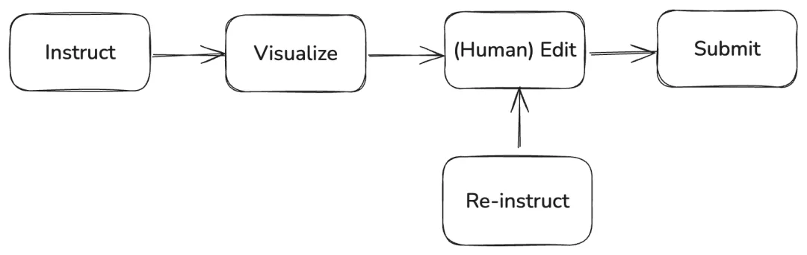
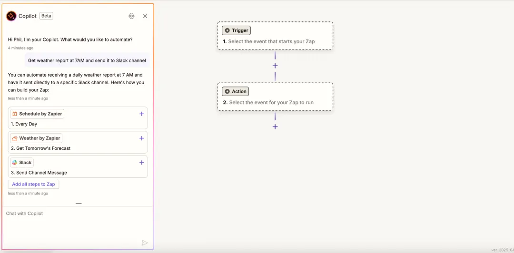

## 为什么CUI不是万能的？
- **用户交互总是和上下文高度相关。** 用户使用一个软件绝非总是从全新的空白状态开始，更多的时候是着眼于一个具体的对象。    
- **用户交互需要视觉辅助和引导。** 我们的世界不仅靠软件驱动，还受制于大量的物理条件，还要对付上下游之间的采购博弈，甚至国家间的贸易壁垒。
- **用户交互需要安全确认。** 用户交互不仅仅是执行输入和观察输出，还包括审慎地检查输出的效果。
- **用户交互是一个渐进的创作过程。** 当面临如何让用户确认中间创作成果的问题。这些中间成果依然需要一个特定的GUI来表达。
## 设计原则
1. 在保持正确性的前提下，帮助用户加速完成任务
2. 生成式 AI 技术领域的迭代和变革都不会破坏应用产品本身的连续性
3. 能保持现有的产品差异化优势
## 融合范式 —— IVERS模式「25.04.10」
> Instruct, Visualize, Edit, Reinstruct, Submit

- Instruct：用户给出指令（也可以自动触发）
- Visualize：软件提供带有操作句柄的可视化渲染
- Edit：用户不满可以再次给出指令或者通过人工编辑
- Re-instruct：重复以上
- Submit：确认后提交
### Zapier 实践

Zapier 每一步的Copilot其实都只着眼于一个较小的目标，并且在每一步都让用户一起参与决定后再提交。

**背后的工作：**
1. 首先，Zapier必须为构建工作流的所有组件提供编程接口，并转换成一个包含完整语义信息的JSON声明，这就是实现Function Calling的必要条件，让AI能够理解可以操作的动作方式。
2. 其次，他们还需要仔细规划Agent组合，让每一个Agent能够专注于一项目标，并且能够有效地和其他Agent通讯，将任务传递到下一个目标上。
3. 最后，AI生成的内容还必须能够直接和前端通讯，让指令生成的内容可以准确渲染在画布上。一旦这个渲染完成，用户就可以直接接手Edit或者修改Instruct。