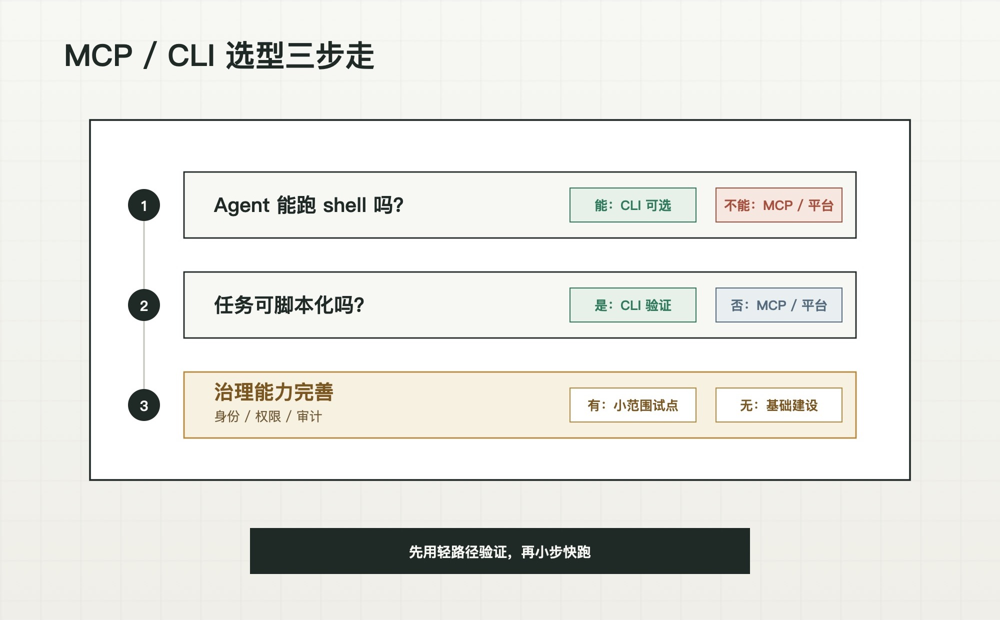
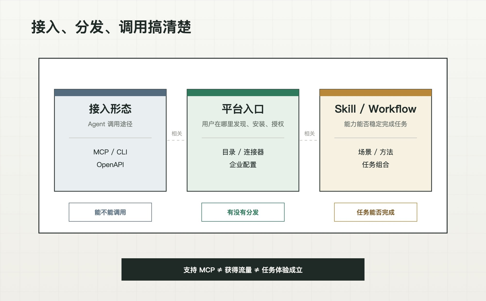

如果一家 SaaS 公司决定让外部 Agent 调用自己的产品，最先冒出来的问题通常是：做 MCP，还是做 CLI？

这个问题看起来虽然很技术，但很快就会变成跨部门讨论：研发关心实现成本，产品关心上手门槛，安全部门关心权限审计，市场关心平台流量分发。每个角色说的都对，但他们讨论的不是同一件事。

先说结论：MCP 和 CLI 不是高低之争，而是场景之争。真正要回答的不是"选哪个"，而是：**能不能做，先做哪个，各做多少，什么时候补另一个。**

上篇[[essays/mcp-or-cli-part-1-deep-dive|《深度解析》]]已经拆过 MCP 和 CLI 的本质差异。这一篇讨论一个更现实的问题：SaaS 团队怎么把产品能力安全、稳定、低成本地开放给外部 Agent。

## 一 前期决策：你的 SaaS 该怎么选

### CLI 和 MCP 没有高低

由于 2026 年开始的 CLI 热度，很容易被误导的一个判断是："先做 CLI，再做 MCP"。这个说法并不严谨，二者其实是针对不同场景的平行方案。更准确的思路是：先用最轻的方案验证真实需求，等场景清晰后再决定要不要补另一种。

在开发者社区里常见"多数本地开发工作流 CLI 已经足够"的观点，这是因为它讨论的默认场景很明确：Agent 已经在终端里，能直接调用 `git`、`npm`、`docker`、`curl` 这类成熟工具，任务多是改代码、跑测试、查日志、发部署[^1]。

也有文章分析到把 MCP / CLI 的判断拆成频率、受众、状态、任务复杂度、分发方式等标准：一次性的、本地的、无状态的任务偏 CLI；重复的、团队协作、有状态管理、需要结构化输出的任务偏 MCP[^2]。

这些判断有参考价值，但并不能直接套到所有 SaaS 上。因为 SaaS Agent 面对的真实场景，是不同角色、不同入口、不同权限边界下的业务操作。

另外，这里说的是"补"，不是"换"。你可能从 CLI 开始，也可能从 MCP 起步，这取决于你的目标用户、目标 Agent、权限要求和分发策略。

### 搞清两件事：选协议，还是判断产品

协议选型和产品摸底，经常被混为一团：一个是"该选 CLI 还是 MCP"，另一个是"我的 SaaS 是否准备就绪"。团队看似在讨论技术选型，实际上混杂了协议可行性、产品治理和分发策略。

**选型：CLI 还是 MCP。**

可选“CLI”的一个核心标准是：**目标 Agent 有没有执行环境**。

- 用户主要在本地、终端、带沙箱的 Agent 里工作（Claude Code、Cursor、GitHub Copilot CLI 这类），能跑 shell，CLI 才是可选项；
- 用户主要在纯网页端、嵌入式或平台内 Agent 里工作，跑不了本机 shell，CLI 就直接出局，只能走 MCP、平台内工具或浏览器操作。

另外还有两个维度值得考虑：

- 任务越明确、可被脚本化，CLI 的编排优势越明显；若任务复杂、中间态不确定，CLI 将不再有优势。
- 你的目标分发渠道是自建还是借助平台，也会有所不同。MCP 更好接入平台，而 CLI 更多需要自行分发。

**产品：是否准备就绪**

反观一些常见的维度：权限、审计、身份、多人协作，它们并不左右实际的协议选型，而是用来判断"你的产品是否做好准备"。

- **权限与审计**：这本质上是一层服务端能力。CLI 本身不做鉴权——就像 `git push`，"谁有权限、记到谁头上"都由 GitHub 服务端判断和记录，CLI 只是带着你的凭证发请求。所以如果你的产品还不具备一套相对完整的鉴权体系，就要考虑是否要先把身份、授权、写操作确认和审计补齐。
- **身份模型**：Agent 以什么身份来“操作数据”，是个人身份还是应用身份，对 MCP 和 CLI 来说，应用凭证和个人 OAuth 都可以做。差别在于运行形态会影响默认授权体验：本地 CLI 更容易沿用个人登录和本机凭证，远程 MCP 更常遇到 OAuth、应用授权和企业权限配置。
- **业务面宽窄**：产品提供的 OpenAPI 越多，越需要"按需暴露"。如果 MCP server 不做工具分组、按需暴露，tools 会挤占 Agent 上下文；如果 CLI 没有清晰的命令分层和结构化输出，Agent 也会在 help 探索里迷路。所以，核心高频操作适合做成稳定、结构化、容易读取的 MCP，长尾操作则要看用户场景决定放在 MCP 里按需开放，还是通过 CLI 让专家用户自行调用。

由此可见，选什么协议有先决条件，但最重要的是你的产品是否有完整的鉴权、权限体系，你对产品的功能划分是否有清晰判断。

### 垂直 SaaS 场景分析

拿 3 个垂直领域的 SaaS 来评估一下。

- **开发者工具：天然偏 CLI，产品侧负担较轻。** 选型上，用户本来就在终端、IDE、本地或云端代码环境里工作，任务又常是确定性的（查仓库、改配置、跑构建、发部署），天然适配 CLI。产品侧上，用户多是开发者、操作多在个人身份下、合规压力相对较小。所以 CLI + 清晰 help + 结构化输出，往往比 MCP 更快。

- **协作 / 知识库产品：协议偏 MCP，产品侧需要考虑协作和权限需要。** 首先，用户未必懂命令行、入口多在网页端或平台内，这就容易把 CLI 挡在外面，天然更倾向 MCP 。产品侧，高频任务涉及多人权限、文档范围、评论、分享，这些基建也需要重点关注。

- **CRM / HR / 审批类 SaaS：协议看环境，真正重的是产品侧。** 选哪个协议，还是先看用户在什么 Agent 里、跑不跑得了 shell。而这类产品真正的难点在于，谁发起、能不能做、是否需要确认、结果要审计，这是产品能力，无论你最后用 CLI 还是 MCP，都得先把身份、授权、审批流和日志建起来。

以上提供了几个常见垂直 SaaS 的拆解思路：先看执行环境和任务形态来判断协议类型，再从产品层面看鉴权、权限和安全是否完备，有无前置动作。

### 混合是趋势

这个框架只是帮你判断"先做哪个"，不是"只做哪个"。从飞书和 Notion 已发布的产品来看，有规模、多用户、多入口的 SaaS 已经开始同时提供 CLI 与 MCP 形态：

- 用 CLI 服务本地 Agent 用户、开发者用户和确定性流程；
- 用 MCP 服务网页端用户、多租户场景和强治理客户。

不过 MVP 阶段还是不要贪多。先选一条最贴合高价值场景的路线，覆盖 3-5 个高频操作上线，观察 Agent 和真实用户具体怎么用，再做后续考虑。

## 二 上线后的判断

### 接入门槛

CLI 要在命令行中安装包。对研发或 IT 这类技术用户小事一桩，对行政、销售、运营、管理者这类非技术用户就是一个门槛。好在现在 Agent 很多都可以自动执行命令行，这个门槛也有所降低。

MCP 要在 Agent 中设置。用户通常要在 Agent 客户端或平台找到 MCP、完成授权、确认权限范围。前期对小白来说是复杂的，不过这个操作路径已经逐渐被平台产品化：有的走应用目录，有的走连接器，有的走 MCP 配置，手动配置成本会逐步下降。

所以，对于新手用户的接入门槛，最重要的是"谁有更少摩擦的接入路径"。当前看，面对非技术用户，平台内安装 MCP 的理解成本更低；面对技术用户，CLI 仍然更高效直接。

### 跨 Agent 通用性

现在的 AI 发展日新月异，用户不会只用一个 Agent。今天用 Claude，明天试 Cursor，企业里可能还接了 Qoder、Codex 或自研 Agent。你的产品能不能"一次安装，随时可用"，影响很大。

CLI 在这点上有天然优势：只要 Agent 能跑 shell，安装路径、认证、网络权限一致，你的 CLI 就能用，一套代码覆盖多个 Agent 产品。

MCP 虽是统一协议，但不同 MCP host 对 tools、resources、prompts、OAuth、审批确认等能力支持不完全一致。接入不同的平台仍需要逐个验证。对企业来说，"支持 MCP" ≠ "所有 Agent 体验一致"。

### 可见性、信任与审计

Agent 替用户操作真实业务后，用户接下来就要问：它到底干了什么？会不会乱来？出了问题能不能回滚？

CLI 的优势是调试透明。执行了什么命令、返回了什么、哪一步报错，用户往往能直接看到。这个"看得见"对开发者友好。

但企业审计却不是"终端里看得见"这么简单。金融、医疗、政企客户真正要的是：谁在什么时间、基于什么授权、通过哪个 Agent、对哪个业务对象做了什么操作，是否经过确认，结果是否可回溯。

这部分就不是协议能够解决的了，需要由产品的鉴权、网关和权限体系来共同实现，有这部分对合规的需求只能靠自己兜底了。

当然，如果你的产品已经有成熟的鉴权与审计体系，这就不再是一个判断变量，重点放在执行环境和分发策略上即可。

### 分发与平台生态

这是最容易被技术团队忽视的运营差异。

CLI 是去中心化分发。你可以通过官网、npm、brew、应用市场、产品内引导或企业 IT 部署来推广。好处是渠道在自己手里，一套代码所有可执行环境通用，代价是”被用户发现”全靠自己。

MCP 是平台化分发。你把 MCP 服务接入不同 Agent 入口，可能获得一部分”被发现”和”被安装”的机会。风险是这些入口成熟度不同：有的是应用目录、有的是企业连接器、有的是 MCP 配置能力，审核标准、展示规则、权限模型和上架流程也各不相同，渠道不完全在自己手里。

而谁会成为“主流平台”，各大公司也还在你追我赶中。截至 2026 年 6 月，OpenAI 的 Apps SDK 已经把 ChatGPT 内应用体验建立在 MCP server 之上[^3]；Google 的 Gemini CLI 支持通过 MCP server 和 extensions 扩展能力[^4]；GitHub Copilot CLI 也在把 MCP servers、skills、plugins、subagents 等能力放进自己的入口里[^5]。

这些变化说明，头部 Agent 平台都在加紧建设自己的工具、应用、终端、连接器和市场入口，形势也并未明朗。另外，产品方也不能把”支持 MCP”等同于”获得平台流量”。平台的 MCP 服务变多以后，入口拥挤、质量参差、认证差异和安全顾虑都会出现。上架只是开始，真正的使用还要靠场景、品牌、文档、示例和产品内引导。

对 SaaS 产品方来说，真正要分清的是三层：接入形态决定了 Agent 怎么调用，平台入口决定了用户从哪里发现，Skill 和 workflow 决定了产品能力能否被稳定地组合并执行。三者不要混在一起判断。

再拿飞书和 Notion 来举例。飞书倾向工具化接入：用 Lark CLI 和 Lark OpenAPI MCP 让外部 Agent 调用业务能力，以自身成熟开放平台为基础，进一步拥抱外部 Agent 扩展自身的用户底盘[^6]。Notion 则同时提供 hosted Notion MCP 和 `ntn` CLI，并把 Agent 能力融合进工作空间[^7]，这其中既是作为“工具”拥抱外部平台，也是加强自身“平台化”的底座。

这两条路对普通 SaaS 都不容易照搬，更现实的起点是：借 MCP 市场势能解决冷启动，或做一个轻量 CLI 服务已有的专家级用户。

> 如果再往上想一层，**随着 Skill 这个上层抽象的成熟，”MCP 还是 CLI”这个问题可能将不再重要。** 一个 Skill 底层执行的是 MCP 还是 CLI，对用户和 Agent 来说会越来越不重要，他们只关心任务是否完成。
>
> 企业真正该投入精力的，是怎么把高价值、高频场景封装成 Skill 友好的能力包。当然 Skill 也不是终点，完整的 Agent 化还需要目标理解、计划执行、确认异常处理，以及可检查、可追责、可优化的产品过程，这里就不做展开了。

### 商业战略

最后还想探讨一下：你是否愿意把核心能力开放给外部 Agent？

2026 年的行业共识越来越清晰：功能壁垒正在快速瓦解——以前几周才能做出的功能，现在借助 AI 工具几小时就能复制。真正难被替代的壁垒，是跨客户、跨时间沉淀下来的领域上下文：业务记录、用户偏好、决策模式、流程规则。换句话说，**SaaS 开放给 Agent 的本质不是"功能接口"，而是"上下文接口"。**

这直接影响你暴露什么、暴露多少。如果你的产品沉淀了大量领域上下文，Agent 每次调用都在加深这层积累，开放反而可能强化壁垒，CLI 和 MCP 都支持数据的读写能力。当然这有前提：你必须做好分级授权、写操作确认、审计追踪、撤销机制、限流和敏感对象隔离。如果这些治理能力还没准备好，就不要急着把核心写入操作暴露出去。

反过来，如果你的核心价值在交互体验或算法本身，可以只考虑开放周边能力（查询、导入导出、触发任务），把核心操作留在自家产品内。这个范围才是真正的“战略判断”，它直接决定了你的产品在 AI 时代会处于什么生态位。

## 三 可能的坑

讨论完路线，再看看实际落地在工程和运营方面可能踩的坑。上篇已经提到过 Tool 数量、CLI 冷启动和沙箱成本，这里补充几个上线前最容易踩的。

**技术实现：**

- **MCP 版本兼容性。** MCP 还在快速演进。计划于 2026-07-28 发布的新版本 MCP 规范，方向包括无状态核心、Tasks、MCP Apps 等[^8]。做了 MCP 服务后，要持续跟进规范更新和各 Agent host 的兼容性。
- **CLI 跨平台和版本碎片。** 用户的操作系统五花八门，命令行行为、安装路径、权限和网络环境都有差异；用户装的 CLI 版本和你的最新版不一致，也会导致各种命令失败。
- **任务状态要自行管理。** 要由你的服务端、数据库、网关或应用层显式设计，而不是协议兜底。

**Agent 调用：**

- **Agent 调用强度远超人类。** 人一分钟点几十次按钮，Agent 可能一分钟内发起上百次 API 调用——单个任务就可能触发 10-20 次连续请求。如果你的限流策略是按人类使用模式设计的，Agent 接入后很容易打满限额甚至触发风控。需要为 Agent 场景单独设计调用配额、限流梯度和熔断机制。
- **返回内容是攻击面。** Agent 会把工具返回的内容当成上下文处理。如果返回里混入恶意指令，比如从用户输入或第三方数据带进来的内容，Agent 可能被诱导做非预期操作。要对返回内容做清洗、标注来源、限制长度，对写操作做确认。

**运营成本：**

- **维护成本留有余地。** 从能用到能上生产，大量工作量花在边界情况、稳定性、权限、可观测性和跨客户端测试上。你的接口在一个 Agent 上跑得好，不代表在所有 Agent 上都好。
- **尽早建立”Agent 调用”的观察机制。** Agent 的真实调用模式往往和设计预期不一样：哪些能力被频繁调用、哪些参数常出错、哪些流程需要人工确认，都要能观测、能调整。

## 四 结语

回到最初的问题：MCP 还是 CLI？我们以三句话收尾：

1. **先看用户，再看自己。** 决定 CLI 还是 MCP 的前提条件：目标 Agent 是否能运行 shell。再从权限、审计、身份、多人协作维度，评估自身是否已准备得当。

2. **CLI 和 MCP 只分场景，没有高低。** 不存在”先做 CLI 再升级 MCP”，只有”你的场景更适合哪个”。

3. **最终走向 1+1。** 你要做的并不是”二选一”，而是”先做哪个、各投多少、什么时候补另一个”。

以上两篇内容，搞清楚了“是什么”和“为什么”，接下来我们将深入到「CLI、MCP 怎么做」的细节中，看看 AI 时代的“接口设计”和传统的 OpenAPI 有何相同与不同。

## References

[^1]: AI Expert: _MCP vs CLI for AI Development: Why Most Teams Are Choosing the Terminal_. https://www.ai-expert.co.uk/blog/mcp-vs-cli-for-ai-development-why-most-teams-are-choosing-the-terminal

[^2]: systemprompt.io: _Choose MCP or CLI in Claude Code With 5 Criteria_. https://systemprompt.io/guides/mcp-vs-cli-tools

[^3]: OpenAI Developers: _Apps SDK_. https://developers.openai.com/apps-sdk

[^4]: Google Gemini CLI Docs: _Extensions_；_MCP Server_. https://google-gemini.github.io/gemini-cli/docs/extensions/ ; https://google-gemini.github.io/gemini-cli/docs/tools/mcp-server.html

[^5]: GitHub: _GitHub Copilot CLI_. https://github.com/features/copilot/cli

[^6]: Lark Suite: _Lark CLI_；_Lark OpenAPI MCP_. https://github.com/larksuite/cli ; https://github.com/larksuite/lark-openapi-mcp

[^7]: Notion Developers: _Notion MCP_；Notion Help: _Use Notion from your terminal with Notion CLI_. https://developers.notion.com/guides/mcp/overview ; https://www.notion.com/help/use-notion-from-your-terminal-with-notion-cli

[^8]: MCP Blog: _The 2026-07-28 MCP Specification Release Candidate_. https://blog.modelcontextprotocol.io/posts/2026-07-28-release-candidate/
