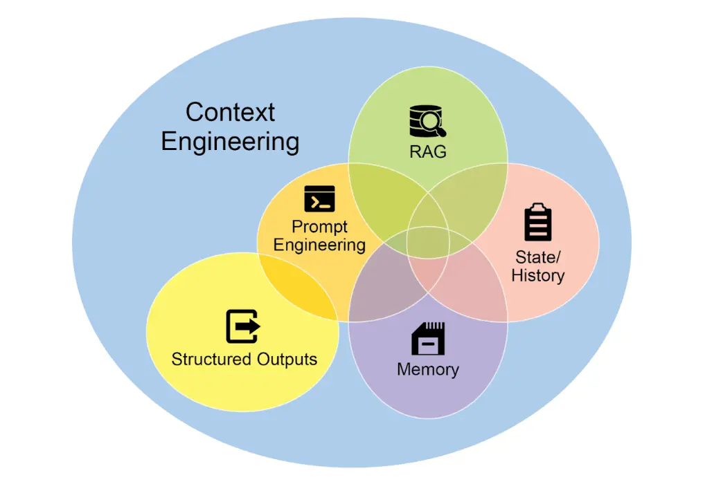
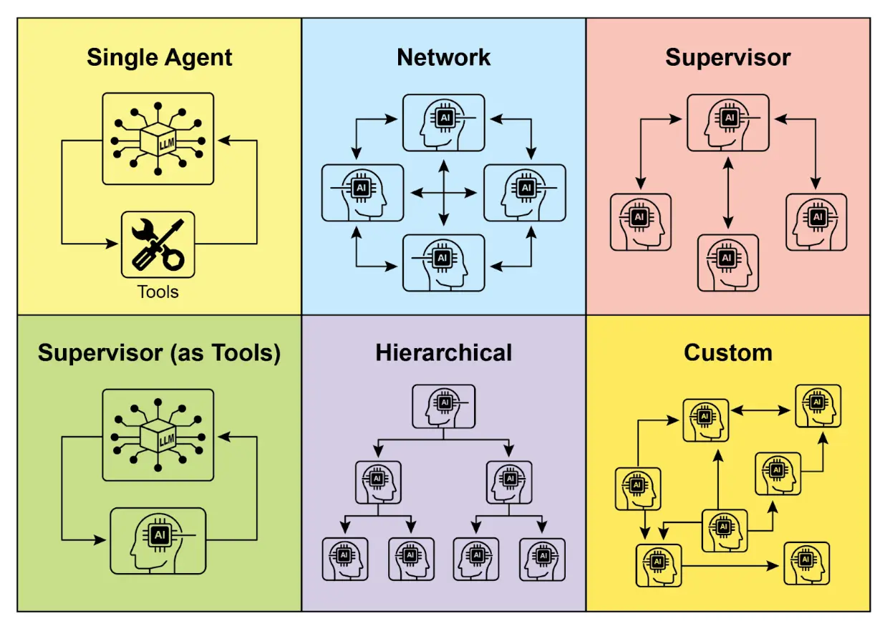
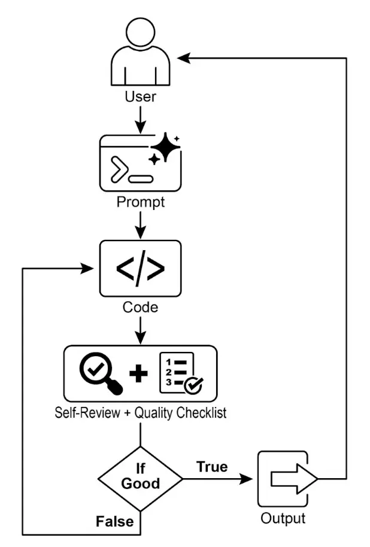
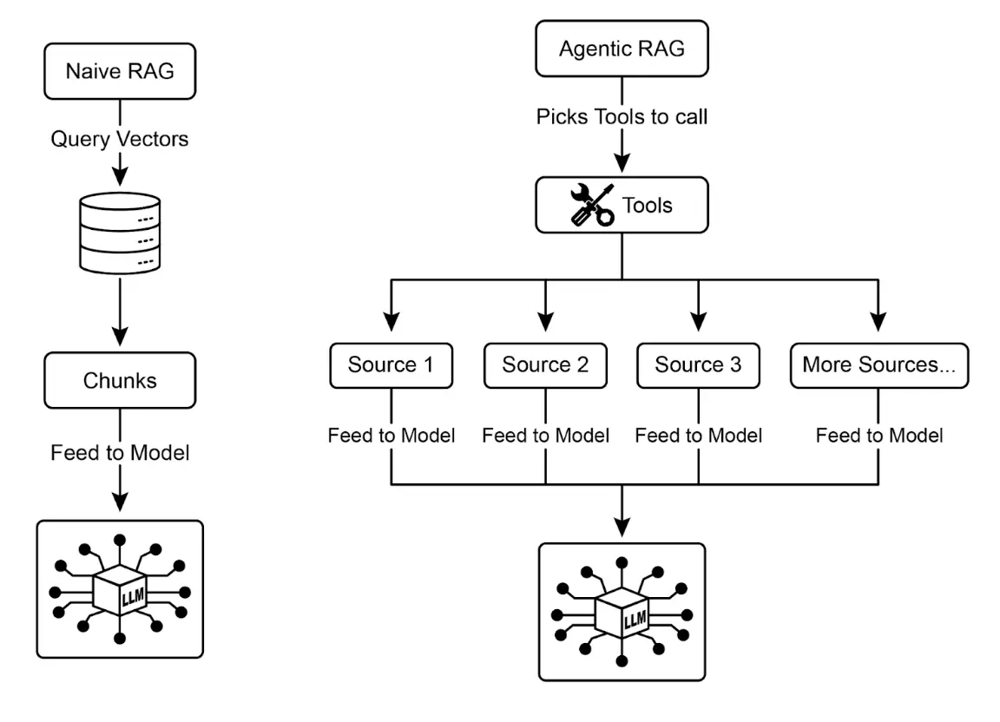
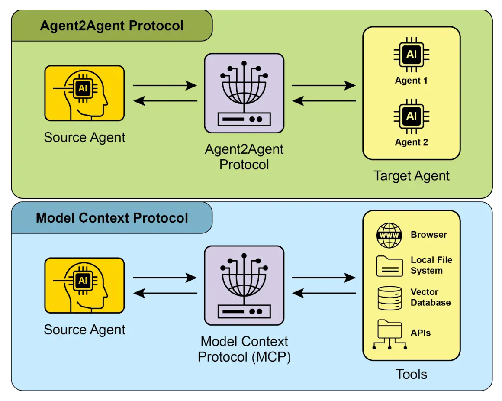
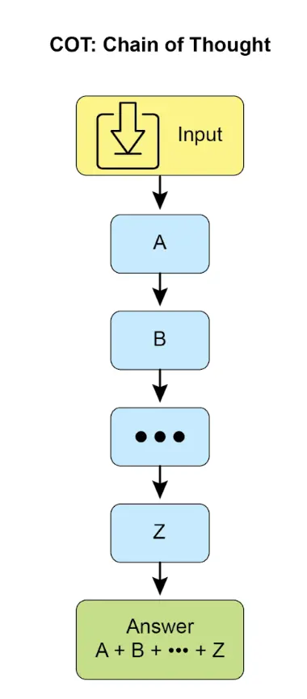
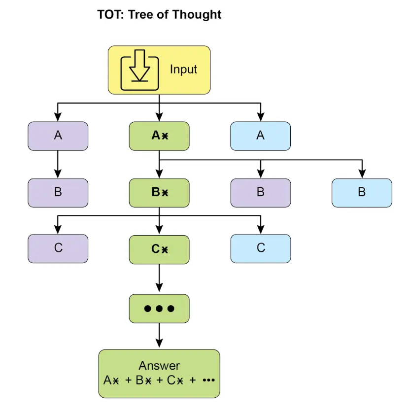
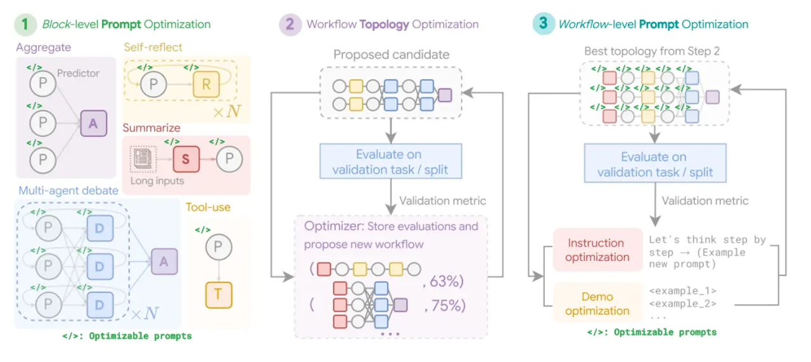

> **智能体** —— 一种能够感知环境并采取行动以实现特定目标的系统。从传统大语言模型演化而来，具备**规划、工具使用和环境交互**等能力。
> 1. 获取任务目标
> 2. 扫描环境信息
> 3. 制定计划
> 4. 执行计划
> 5. 学习与优化
## 一 提示链 —— 顺序流程
提示链，是在使用 LLM 时处理复杂任务的强大范式。主张采用分而治之策略，将原本棘手的问题拆解为一系列更小、更易管理的子问题。每个子问题通过专门设计的提示单独处理，并将前一步的输出作为下一步的输入，形成链式依赖。
此外，提示链不仅仅是拆解问题，还能集成外部知识和工具。每一步都可以指示 LLM 与外部系统、API 或数据交互，扩展其知识和能力。
1. **单一提示的局限性：** 对于多层次任务，单一复杂提示往往效率低下，模型容易忽略部分指令、丢失上下文、错误累积、上下文窗口不足或出现幻觉。
2. **通过顺序拆解提升可靠性：** 提示链通过将复杂任务拆解为聚焦的顺序流程，显著提升可靠性和可控性。
3. **结构化输出的重要性：** 提示链的可靠性高度依赖于各步骤间数据的完整性。建议指定结构化输出格式，如 json 或 xml。
### 提示工程
#### 优秀的系统提示的关键组成有哪些？
- **角色和目标**：明确智能体身份及主要任务
- **工具定义**：列出可用工具、功能描述及使用方法
- **约束与规则**：明确智能体不可以做的事情
- **流程指令**：指导智能体应采用哪些模式
- **示例轨迹**：提供成功的“思考-行动-观察”循环示例
#### 提示词的最佳实践
- **提供示例**：一/少样本示例是最有效的引导方式。
- **设计简洁**：提示应简明清晰，避免术语和复杂表达。
- **明确输出要求**：==清楚定义期望格式、长度、风格和内容。==
- **优先正面指令**：专注于告诉模型“做什么”而非“不做什么”。
- **控制最大 Token 长度**：用模型参数或提示指令管理输出长度。
- **提示变量化**：==应用场景下用变量提升提示复用性，避免硬编码。==
- **尝试不同输入格式和风格**：测试不同表达方式和语气，寻找最佳效果。
- **分类任务示例顺序随机化**：==防止模型过拟合特定类别顺序。==
- **适应模型更新**：模型不断升级，需测试并调整现有提示。
- **尝试不同输出格式**：尤其非创意任务，尝试 JSON、XML 等结构化输出。
- **与他人协作实验**：团队合作能带来更多有效提示。
- **CoT** **最佳实践**：如答案置于推理后，单一答案任务温度设为 0。
- **记录提示尝试**：结构化记录提示、配置和结果，便于追踪和优化。
- **提示代码化管理**：==应用集成时将提示存于独立文件，便于维护和版本控制。==
- **自动化测试与评估**：生产系统需自动化测试和评估，确保提示泛化能力。
### 上下文工程

上下文工程包括<u>系统提示</u>、可加入<u>外部数据</u>，如检索文档、工具输出，以及<u>用户身份</u>、<u>历史交互</u>、<u>环境状态</u>等隐性数据。工程环节包括构建数据获取与转换管道、建立反馈循环持续优化上下文质量。
实际应用中，可用专门<u>调优系统</u>自动提升上下文质量，可用<u>样例输入</u>和<u>评估指标系统</u>优化模型响应，无需手动重写。
- **系统提示：** 定义 AI 操作参数的基础指令
- **外部数据**：
    - 检索文档：主动从知识库中获取信息
    - 工具输出：AI 调用外部 API 获取实时数据
- **隐式数据**：如用户身份、交互历史、环境状态。集成隐式上下文需注意隐私和伦理。
### 实践应用与场景
提示链适用于构建智能体系统时的多种场景。其核心价值在于将复杂问题拆解为顺序、可管理的步骤。常见应用包括：
1. **信息处理流程**：对原始信息多次转换
2. **复杂问答**：回答需多步推理或多源信息整合的问题。复杂流程常结合并行数据采集与链式依赖的综合与优化
3. **数据提取与转换**：将非结构化文本转为结构化格式，通常需多步迭代修正以提升准确性和完整性
4. **内容生成流程**：适用于创意写作、技术文档等
5. **有状态对话智能体**：提示链为对话连续性提供基础机制，系统性整合前序信息或实体，维护上下文    
6. **代码生成与优化：** ==提示链通过拆解复杂任务为可管理子问题，降低每步模型复杂度，并允许在模型调用间插入确定性逻辑，实现中间数据处理、输出验证和条件分支。==
7. **多模态与多步推理**：处理多模态数据集需将问题拆解为多个基于提示的小任务。
### 实战示例
提示链实现方式包括脚本中的顺序函数调用，也可用专门框架管理流程、状态和组件集成。LangChain、LangGraph、Crew AI、Google Agent Development Kit（ADK）等框架为多步流程构建和执行提供了结构化环境，适合复杂架构。
以 LangChain 和 LangGraph 为例，其核心 API 专为链式和图式操作设计。
- LangChain 提供线性序列抽象
- LangGraph 支持有状态和循环计算，适合更复杂的智能体行为
### 参考
- [LangChain LCEL 文档 - python.langchain.com](https://python.langchain.com/v0.2/docs/core_modules/expression_language/)
- [LangGraph 文档 - langchain-ai.github.io](https://langchain-ai.github.io/langgraph/)
- [Prompt Engineering Guide: Chaining Prompts - promptingguide.ai](https://www.promptingguide.ai/techniques/chaining)
- [OpenAI API 文档：通用提示概念 - platform.openai.com](https://platform.openai.com/docs/guides/gpt/prompting)
- [Crew AI 文档：任务与流程 - docs.crewai.com](https://docs.crewai.com/)
- [Google AI 开发者提示指南 - cloud.google.com](https://cloud.google.com/discover/what-is-prompt-engineering?hl=zh-cn)
- [Vertex Prompt Optimizer - cloud.google.com](https://cloud.google.com/vertex-ai/generative-ai/docs/learn/prompts/prompt-optimizer)
## 二 路由 —— 动态决策&路径切换
提示链在需要自适应响应的场景下，其适用性有限。现实中的智能体系统通常需要根据环境状态、用户输入或前序操作结果等因素，在多个潜在动作之间进行仲裁。这种动态决策能力——即根据特定条件将控制流导向不同的专用函数、工具或子流程——是通过“路由”机制实现的。
路由将智能体的操作框架从固定执行路径转变为动态评估特定标准、从一组可能的后续动作中进行选择的模式。
一个更高级的路由智能体可以：
1. 分析用户查询
2. 根据查询意图进行路由，路由到不同的子智能体、工具链

==如何执行评估并引导流程？==
- **基于 LLM 的路由**：通过提示 LLM 分析输入，并输出指示下一步或目标的标识符或指令。
- **基于嵌入的路由**：将输入查询转向向量嵌入，再与代表不同路由或能力的嵌入进行比对，将查询路由到最相似的路径。适用于语义路由，即决策基于输入的含义而非关键词。
- **基于规则的路由**：使用预定义规则或逻辑，根据关键词、模式或结构化数据进行路由。这比 LLM 路由更快、更确定，但灵活性较低。
- **基于机器学习模型的路由**：采用如分类器等判别模型，在小规模标注数据集上专门训练以实现路由任务。其特点是监督微调过程，路由逻辑编码在模型权重中。与 LLM 路由不同，决策组件不是推理时执行提示的生成模型，而是已微调的判别模型。
### 实践应用与场景
路由的实现使系统超越了确定性顺序处理，能够开发出更具适应性的执行流，动态响应更广泛的输入和状态变化。
- 在人机交互场景中，路由用于解析用户意图。系统对自然语言查询进行初步分析，决定后续动作。
- 在自动化数据与文档处理流程中，路由承担分类与分发功能。系统根据内容、元数据或格式分析，并将其导入相应工作流。
- 在涉及多个专用工具或智能体的复杂系统中，路由充当高级调度器。
### 实战示例
代码实现路由需定义可能路径及决策逻辑。LangChain 和 LangGraph 等框架提供了专用组件和结构。
- LangGraph 的图结构适合复杂多步流程的显式状态与转换定义
- Google ADK 则侧重能力（工具）定义，由框架自动路由，适合动作明确的智能体
### 参考
- [LangGraph 文档 - langchain.com](https://www.langchain.com/)
- [Google Agent Developer Kit 文档 - google.github.io](https://google.github.io/adk-docs/)
## 三 并行化
并行化指的是同时执行多个组件，比如 LLM 调用、工具使用，甚至整个子智能体。并行执行允许独立任务同时运行，大幅缩短可拆分为独立部分的任务的整体执行时间。
核心思想是识别流程中彼此无依赖的部分，并将他们并行执行。尤其是涉及外部服务有延迟时，可以同时发起多个请求，显著提升效率。
实现并行化通常需要支持异步执行或多线程的框架。并行架构会增加设计、调试和日志等开发复杂度与成本。
各框架实现机制不同：LangChain 用 `RunnableParallel` 明确定义并行处理链；Google ADK 则可通过多智能体委托，由主协调模型分派子任务并并发执行。
### 实践应用与场景
1. 信息收集与调研
2. 数据处理与分析
3. 多 API 或工具交互
4. 多组件内容生成
5. 验证与校验
6. 多模态处理
7. A/B 测试或多方案生成
### 参考
- [LangChain Expression Language (LCEL) 文档 – 并行处理](https://python.langchain.com/docs/concepts/lcel/)
- [Google Agent Developer Kit (ADK) 文档 – 多智能体系统](https://google.github.io/adk-docs/agents/multi-agents/)
- [Python asyncio 官方文档](https://docs.python.org/3/library/asyncio.html)
## 四 反思
反思模式指的是智能体==对自身的工作、输出或内部状态进行评估==，并利用评估结果来提升性能或优化响应。这是一种==自我纠错或自我改进机制==，使智能体能够==根据反馈、内部批判或与目标标准的对比==，反复优化输出或调整策略。
反思引入了反馈循环。智能体不仅仅生成输出，还会审视该输出（或生成过程），识别潜在问题或改进空间，并据此生成更优版本或调整后续行为。

**经典流程包括：**
1. **执行**：智能体完成任务或生成初始输出
2. **评估/批判**：Agent（通过一次 LLM 调用）分析上一步结果，检查事实准确性、连贯性、风格、完整性、是否遵循指令
3. **反思/优化**：根据批判结果，智能体决定如何改进，可能生成优化后的输出、调整参数，甚至修改整体计划
4. **迭代（可选但常见）**：优化后的输出或调整后的方案再次执行，反思过程可重复，直到达到满意结果或满足终止条件

==一种高效的反思实现方式是将流程分为两个逻辑角色：生产者和批评者。==虽然单一智能体可以自我反思，但采用两个专门智能体（或两次 LLM 调用，分别使用不同系统提示）通常能获得更客观、更结构化的结果。
5. **生产者智能体：** 负责任务的初步执行，专注于内容生成，它根据初始提示生成第一版输出
6. **批评者智能体：** 专门评估生产者所生成的输出，拥有不同的指令和角色设定。批评者根据特定标准（如事实准确性、代码质量、风格要求、完整性等）分析生产者的工作，发现问题，提出改进建议并给出结构化反馈
这种分工能有效避免智能体自我评审时的“认知偏差”。批评者以全新视角专注于发现错误和改进空间，其反馈再传递给生产者，指导其生成更优版本。
==实现反思通常需要在智能体工作流中引入反馈循环，可通过迭代循环或支持状态管理和条件跳转的框架实现。==反思模式对于构建能够输出高质量结果、处理复杂任务、具备一定自我意识和适应性的智能体至关重要。
反思与目标设定和监控的结合值得关注。==目标为智能体自我评估提供最终标准，监控则跟踪其进展。==在实际应用中，反思常作为纠错引擎，利用监控反馈分析偏差并调整策略。这种协同让智能体从被动执行者转变为主动适应目标的系统。
此外，反思模式在 LLM 具备**对话记忆**时效果显著提升。对话历史为评估阶段提供关键上下文，使智能体不仅能孤立的评估输出，还能结合过往互动、用户反馈和目标变化进行判断。智能体从过去的批判中学习，避免重复错误。没有记忆时，每次反思都是独立事件；有记忆时，反思成为积累过程，每轮迭代都在前一轮基础上进步。
反思会导致计算成本和延迟增加，不适合对时效性要求高的场景。此外，该模式对内存消耗较大，每次迭代都会扩展对话历史（模型上下文窗口溢出），包括初始输出、批判和后续优化内容。
### 实践应用与场景
反思模式适用于对输出质量、准确性或复杂约束要求较高的场景：
1. 创意写作与内容生成：优化生成的文本、故事、诗歌或营销文案
2. 代码生成与调试：编写代码、发现错误并修复
3. 复杂问题求解：在多步推理任务中评估中间步骤或方案
4. 摘要与信息整合：优化摘要的准确性、完整性和简洁性
5. 规划与策略制定：评估方案并发现潜在缺陷或改进点
6. 对话智能体：回顾对话历史，保持上下文、纠正误解或提升响应质量
### 实现示例
完整迭代反思需要有状态工作流（如 langgraph），单步反思可在 langchain 用 LCEL 实现输出批判和优化。
Google ADK 可通过顺序工作流实现反思，一智能体输出由另一智能体批判，支持后续优化。
### 参考
- [训练语言模型自我纠错的强化学习方法 - arxiv.org](https://arxiv.org/abs/2409.12917)
- [LangChain Expression Language (LCEL) 文档 - python.langchain.com](https://python.langchain.com/docs/introduction/)
- [LangGraph 文档 - langchain.com](https://www.langchain.com/langgraph)
- [Google Agent Developer Kit (ADK) 文档：多 Agent 系统 - google.github.io](https://google.github.io/adk-docs/agents/multi-agents/)
## 五 工具使用（函数调用）
工具使用模式通常通过“函数调用”机制实现，使智能体能够与外部 API、数据库、服务甚至执行代码进行交互。它允许智能体核心的 LLM 根据用户请求或任务当前状态，决定何时以及如何调用特定的外部函数。
**典型流程包括：**
1. **工具定义：** 向 LLM 描述外部函数或能力，包括 函数用途、名称、参数类型及说明
2. **LLM 决策：** LLM接收用户请求和可用工具定义，根据理解判断是否需要调用一个或多个工具来完成请求
3. **函数调用生成**：如果 LLM 决定使用工具，会生成结构化输出（JSON），指定要调用的工具名称及参数（从用户请求中提取）
4. **工具执行**：智能体框架或编排层拦截结构化输出，识别请求的工具并提供参数实际执行外部函数
5. **观察/结果**：工具执行的输出或结果返回给智能体
6. **LLM 处理（可选且常见）**：LLM 将工具输出作为上下文，用于生成最终回复或决定下一步（调用工具、反思或直接回复）

**工具模式**，突破了 LLM 训练数据的限制，使其能够访问最新消息、执行内部无法完成的计算、操作用户专属数据或触发现实世界动作。
LangChain、LangGraph、Google Agent Developer Kit（ADK）等框架都支持工具定义和集成，通常利用现代 LLM（如 Gemini、OpenAI 系列）的原生函数调用能力。在这些框架中，你可以定义工具，并配置智能体具备使用这些工具的能力。
### 实践应用与场景
工具模式适用于所有智能体需要超越文本生成、执行动作或获取动态信息的场景：
1. 外部信息检索
2. 与数据库和 API 交互
3. 计算与数据分析
4. 发送通讯
5. 执行代码
6. 控制其他系统或设备
### 实战示例
在 LangChain 框架中实现工具使用分为两步：
1. 首先定义工具（通常封装现有 Python 函数或可运行组件）
2. 然后将工具绑定到语言模型，使模型在需要时能生成结构化的工具调用请求
Google Agent Developer Kit（ADK）内置了可直接集成到智能体能力中的工具库。
### 参考
- [LangChain 文档（工具） - python.langchain.com](https://python.langchain.com/docs/integrations/tools/)
- [Google Agent Developer Kit (ADK) 文档（工具） - google.github.io](https://google.github.io/adk-docs/tools/)
- [OpenAI 函数调用文档 - platform.openai.com](https://platform.openai.com/docs/guides/function-calling)
- [CrewAI 文档（工具） - docs.crewai.com](https://docs.crewai.com/concepts/tools)
## 六 规划
规划本质上是智能体或智能体系统能够制定一系列行动，从初始状态逐步迈向目标状态的能力。
智能体的核心任务是自主制定通往目标的路径。它首先要理解初始状态和目标状态，然后发现连接两者的最有行动序列。计划并非预先设定，而是根据请求动态生成。
这一过程的显著特征是适应性。初始计划只是起点，而非死板剧本。智能体的真正能力在于能根据新信息调整方向，灵活应对障碍。
动态规划是一种特定工具，并非万能方案。==当问题的解决路径已知且可重复时，约束智能体按照预定、固定流程执行更有效。==这种方式限制了智能体的自主性，减少了不确定性和不可预测性，确保结果可靠一致。==是否采用规划智能体，关键在于“怎么做”需不需要探索，还是已经明确。==
当用户请求过于复杂，无法通过单一行动或工具完成时，应采用规划模式。只要任务需要一系列相互依赖的操作以实现最终综合结果，都建议应用规划模式。
### 实践应用与场景
在流程自动化领域，规划用于编排复杂工作流。智能体生成计划，按逻辑顺序执行这些步骤，调用必要工具或系统交互以管理依赖关系。
在机器人与自主导航领域，规划是状态空间遍历的基础。无论是实体机器人还是虚拟系统，都需生成路径或行动序列，从初始状态到目标状态，优化时间或能耗等指标，同时遵守环境约束，如避障或遵守交通规则。
该模式也适用于结构化信息合成。例如，生成复杂报告时，智能体可制定计划，分阶段进行信息收集、数据摘要、内容结构化和迭代完善。
在多步骤客户支持场景中，智能体可制定并执行系统化的诊断、解决和升级流程。
### 实战示例
#### Google DeepResearch
1. 将用户请求拆解为多点研究计划
2. 展示给用户审核和修改，实现协同规划
3. 计划确认后，智能体管道启动迭代搜索与分析循环
4. 智能体执行预设搜索、根据收集到的信息动态调整查询，主动发现知识空缺、验证数据点、解决矛盾
系统架构的关键在于异步管理流程，确保即使分析数百个来源也能抵抗单点故障，用户可随时离开并在任务完成后收到通知。
系统还可整合用户私有文档，将内部信息与网络数据融合。最终输出不仅是信息列表，而是结构化、多页报告。
合成阶段，模型对收集信息进行评估，提炼主题，按逻辑分节组织内容。报告通常包含音频概览、图表和原始引用链接，便于用户验证和深入探索。模型还会返回所有检索和参考的来源列表，以引用形式呈现，确保透明和可追溯。
#### OpenAI Deep Research API
- **结构化带引用输出**：确保结论可验证、数据有据可查
- **透明性**：公开所有中间步骤，包括智能体推理、具体搜索查询和代码执行，便于调试和深入分析
- **可扩展性**：可连接私有知识库和内部数据，实现公私融合检索
### 参考
- [Google DeepResearch（Gemini 功能）- gemini.google.com](https://gemini.google.com/)
- [OpenAI：Introducing Deep Research - openai.com](https://openai.com/index/introducing-deep-research/)
- [Perplexity：Introducing Perplexity Deep Research - perplexity.ai](https://www.perplexity.ai/hub/blog/introducing-perplexity-deep-research)
## 七 多智能体协作
多智能体协作模式基于任务分解原则，将高层目标拆分为若干子问题，并分配给具备相应工具、数据访问或推理能力的智能体。
系统的高效不仅源于分工，更依赖于智能体间的通信机制——需要==标准化的通信协议和共享本体==，使智能体能够交换数据、委派子任务并协调行动，确保最终输出一致。
这种分布式架构具备模块化、可扩展和健壮性等优势，单一智能体故障不会导致系统整体失效。
多智能体协作模式设计系统时，多个独立或半独立智能体共同实现目标。每个智能体有明确角色、目标，并可能访问不同工具或知识库。

==协作模式包括：==
- **顺序交接：** 一个智能体完成任务后，将输出传递给下一个智能体
- **并行处理：** 多个智能体同时处理问题不同部分，结果后续合并
- **辩论与共识**：智能体基于不同视角和信息源讨论，最终达成共识或更有决策
- **层级结构：** 管理者智能体根据工具或插件能力动态分配任务给工作智能体，并综合结果。每个智能体可管理相关工具组。
- **专家团队**：不同领域专长智能体（研究员、写作者、编辑）协作完成复杂输出
- **批评-审查者**：智能体生成初步输出，另一组智能体对其进行政策、安全、合规、正确性、质量和目标对齐等评审，进而根据反馈修订。其优势在于健壮性提升、质量改善和减少幻觉或错误。
==多智能体系统本质包括智能体角色与职责划分、通信通道建立，以及任务流程或交互协议的制定。==
### 实践应用与场景
- 复杂研究与分析：学术检索｜总结｜发现趋势｜生成报告
- 软件开发：需求分析｜代码生成｜测试｜文档编写
- 创意内容生成：市场调研｜文案｜涉及｜社媒排期
- 金融分析：数据抓取｜情绪分析｜技术分析｜投资建议
- 客户支持升级：助理智能体｜专家智能体
- 供应链优化：供应商｜制造商｜分销商，协作优化库存、物流与排程
- 网络分析与修复：分级处理与修复
### 关系与通信结构

- **单智能体**：适合可拆分为独立子问题的场景，但<u>能力受限</u>
- **网络型**：多个智能体以去中心化方式直接交互，点对点通信，信息、资源和任务共享，具备弹性，但<u>通信管理和决策一致性较难</u>
- **监督者**：专门智能体“监督者”协调下属智能体，负责通信、任务分配和冲突解决，层级结构清晰，易于管理，但<u>存在单点故障和瓶颈风险</u>
- **工具型监督者**：监督者不直接指挥，而是为其他智能体提供资源、指导或分析支持，<u>赋能而非强制控制</u>
- **层级型**：多层监督者结构，高层监督者管理低层监督者，底层为操作智能体，适合<u>复杂问题分层管理</u>，便于扩展和分布式决策
- **定制型**：针对具体问题或应用定制独特关系与通信结构，适合优化<u>特定性能、动态环境或领域知识集成</u>
### 参考
- [多智能体协作机制：LLM 综述 - arxiv.org](https://arxiv.org/abs/2501.06322)
- [多智能体系统——协作的力量 - medium.com](https://aravindakumar.medium.com/introducing-multi-agent-frameworks-the-power-of-collaboration-e9db31bba1b6)
## 八 记忆管理
在智能体系统中，记忆指的是智能体保留并利用过去交互、观察和学习经验的信息能力。这使智能体能够做出明智决策、保持对话上下文，并不断提升自身能力。
没有记忆机制，智能体就是无状态的，无法保持对话上下文、学习经验或个性化响应，仅能处理简单的一问一答，无法应对多步骤流程或用户需求变化。核心问题是如何高效管理单次会话的临时信息和长期积累的知识。
对于需在对话中保持上下文、跟踪多步骤任务进度或通过回忆用户偏好和历史实现个性化的 Agent，记忆管理是必需的。只要智能体需根据过往成功、失败或新知识学习和适应，都应实现记忆管理。
==智能体的记忆分为两大类 ——==
- **短期记忆（上下文记忆）**：类似于工作记忆，保存当前正在处理或最近访问的信息。==对于使用 LLM 的智能体来说，短期记忆主要体现在上下文窗口中。==
    - 该窗口包含最近的消息、智能体回复、工具使用结果以及当前交互中的智能体反思
    - 高效的短期记忆管理需要在有限空间内保留最相关的信息，<u>常用方法包括对旧对话片段进行摘要或突出关键信息</u>
    - ==上下文窗口有限==，限制了智能体可直接访问的最近信息量。具备“长上下文”窗口的新模型仅仅扩大了短期记忆的容量，使单次交互可容纳更多信息，但<u>这些上下文依然是临时的，会在会话结束后丢失，并且每次处理全部内容成本较高且效率不高</u>
    - 除了短期记忆，还需要真正的<u>持久性、跨会话的信息回溯，以及知识库构建</u>
- **长期记忆（持久记忆）：** 类似长期知识库，作为智能体需要多次交互、任务或较长周期内保留信息的仓库
    - 通常存储在数据库、知识图谱或向量数据库中
    - 在向量数据库中，<u>信息被转换为数值向量并存储</u>，智能体可以通过<u>语义相似度而非关键词精确匹配进行检索，即语义检索</u>
    - 当智能体需要长期记忆中的信息时，会查询外部存储，检索相关数据，并将其整合到短期上下文中，实现知识的融合
### 实践应用与场景
- **聊天机器人与对话式 AI**：
    - 保持对话连贯性依赖短期记忆，需记住用户先前输入以生成合理回复
    - 长期记忆让机器人能回忆用户偏好、历史问题或过往讨论，实现个性化和持续交互
- **任务智能体：**
    - 管理多步骤任务时，需要短期记忆跟踪前序步骤、当前进度和总体目标，这些信息通常存于任务上下文或临时存储
    - 长期记忆用于访问不在当前上下文中的用户相关数据
- **个性化体验**：利用长期记忆存储和检索用户偏好、历史行为和个人信息
- **学习和提升：** 智能体通过学习过往交互不断优化表现，将成功策略、错误和新知识存入长期记忆，便于未来适应
- **信息检索：** 面向问答时会访问知识库（长期记忆），通过 RAG 实现，检索相关文档或数据以辅助回答
- **自主系统：** 机器人或自动驾驶汽车需要记忆地图、路线、物体位置和学习行为
    - 短期记忆用于处理即时环境
    - 长期记忆保持通用环境知识
### 实战示例
#### Google Agent Developer Kit (ADK)
每次与智能体的交互都可视为独立的对话线程，智能体可能需要访问早期交互的数据。ADK 结构如下：
- **Session（会话）—— 跟踪每次聊天：** 单个聊天线程，记录该次交互的消息和行为 Event，并存储与该对话相关的临时数据 State
    > `Session` 对象用于跟踪和管理单个聊天线程。每次与智能体开启对话时，生成一个 Session 对象，包括会话唯一标识、事件记录、会话临时数据及最后更新时间。
    > `SessionService` 负责会话生命周期管理，包括新建、恢复、记录活动（含状态更新）、识别活跃会话及数据清理。
    > 选择合适的 `SessionService` 决定了智能体交互历史和临时数据的存储方式及持久性。
- **State（session.state）—— 会话的临时记事本**：存储在 session 内，仅与当前活跃聊天线程相关的数据
    > 每个 Session 包含一个 state 组件，类似于智能体在当前对话期间的临时工作记忆。**`session.events`** **记录完整聊天历史；****`session.state`** **存储和更新与当前会话相关的动态数据**。
    > `session.state` 是一个字典，以键值对形式存储数据，核心作用是让智能体保留和管理对话所需的细节，如**用户偏好、任务进度、数据收集或影响后续行为的标志**。
    > - `user`前缀关联用户，跨会话共享
    > - `app`前缀关联应用，所有用户共享
    > - `temp`前缀仅本轮有效，不持久化
- **Memory（记忆）—— 管理长期知识**：可检索的信息仓库，来源于历史聊天或外部数据，用于超越当前对话的数据检索
    > `InMemoryMemoryService` 适合测试但不持久化。生产环境推荐使用 `VertexAiRagMemoryService`
#### LangChain & LangGraph
**短期记忆：** 线程级别，跟踪单次会话内的对话。完整历史可能超出上下文窗口，导致错误或性能下降。
==长期记忆：跨会话保存用户或应用级数据==
- **语义记忆：** ==记住事实。保存具体事实和概念，如用户偏好或领域知识，用于提升智能体回复的个性化和相关性。可管理为用户“画像”或事实集合==
- **情景记忆：** ==记住经历。回忆过去事件或行为，常用语智能体记住任务完成方式。实际应用中常通过 few-shot 示例提示实现，让智能体学习成功交互序列==
- **程序性记忆：** ==记住规则。记忆任务执行方法，即智能体的核心指令和行为，通常存于系统提示。智能体可通过“反思”技术自我优化指令==
#### Vertex Memory Bank
Memory Bank 是 Vertex AI Agent Engine 的托管服务，为智能体提供持久的长期记忆。服务利用 Gemini 模型异步分析对话历史，提取关键事实和用户偏好。
### 参考
- [ADK Memory – Google ADK 文档](https://google.github.io/adk-docs/sessions/memory/)
- [LangGraph Memory – LangGraph 概念](https://langchain-ai.github.io/langgraph/concepts/memory/)
- [Vertex AI Agent Engine Memory Bank – Google Cloud 博客](https://cloud.google.com/blog/products/ai-machine-learning/vertex-ai-memory-bank-in-public-preview)
## 九 学习与适应
学习与适应让智能体通过经验不断提升能力，应对新情况。此模式适用于需**在不断变化、不确定或需个性化环境中运行**的智能体。
专用“子智能体”和“监督者”有助于自我改进系统分解大任务并保持进度。LLM 的“上下文窗口”结构（系统提示、核心提示、助手消息）对智能体效率至关重要。
构建能学习的智能体通常需==集成机器学习工具并管理数据流。==
- **强化学习：** 智能体尝试各种行为，对正向结果获得奖励，对负向结果受到惩罚，从而在变化环境中学习最优策略。
- **监督学习：** 智能体通过标注样本学习，将输入与期望输出关联，实现决策和模式识别。
- **无监督学习：** 智能体在无标签数据中发现隐藏关联和模式，有助于洞察、组装和构建环境认知地图。
- **少样本/零样本学习**：利用 LLM 的智能体可通过极少样本或明确指令快速适应新任务，实现对新命令或场景的快速响应
- **在线学习：** 智能体持续用新数据更新知识，适用于实时反应和动态环境中的持续适应。
- **基于记忆学习：** 智能体回忆过去经验，在类似场景下调整当前行为，提升上下文感知和决策能力。

PPO 是一种强化学习算法，常用于训练在连续动作空间（如机器人关节或游戏角色控制）中的智能体。核心思想是对对策进行小幅、谨慎的更新，避免因剧烈变化导致性能崩溃。
DPO 是一种专为 LLM 与人类偏好对齐设计的方法，相较于 PPO 更直接、简化。它通过直接优化 LLM 的人类偏好数据，简化了对齐流程，避免了奖励模型训练的复杂性和不稳定性。
### 实践应用与场景
> SICA 智能体通过自我修改代码实现自我改进，催生了智能编辑器和 AST 符号定位器等工具。
> AlphaEvolve 是 Google 的智能体，结合 LLM 和进化框架，实现算法自主发现与优化，推动基础研究和实际计算应用。
- **个性化助手智能体** 通过长期分析用户行为，优化交互协议，实现高度定制化响应
- **交易机器人智能体** 根据实时高分辨率市场数据动态调整模型参数，优化决策算法，提升收益并降低风险
- **应用智能体** 根据用户行为动态调整界面和功能，提升用户参与度和系统易用性
- **机器人与自动驾驶智能体** 整合传感器数据和历史行为分析，提升导航与响应能力，实现安全高效运行
- **反欺诈智能体** 通过新识别的欺诈模式优化预测模型，提升安全性并减少损失
- **推荐系统智能体** 通过用户偏好学习算法提升内容推荐精准度，实现个性化和上下文相关推荐
- **游戏智能体** 动态调整策略算法，提升游戏复杂度和挑战性，增强玩家体验
- **知识库学习智能体**：智能体可利用 RAG（检索增强生成）维护动态知识库，存储成功策略和遇到的挑战，在决策时参考这些数据，提升适应新场景的能力
### 参考
- Sutton, R. S., & Barto, A. G. (2018). _强化学习导论_. MIT 出版社。
- Goodfellow, I., Bengio, Y., & Courville, A. (2016). _深度学习_. MIT 出版社。
- Mitchell, T. M. (1997). _机器学习_. McGraw-Hill.
- Schulman, J., Wolski, F., Dhariwal, P., Radford, A., & Klimov, O. (2017). “Proximal Policy Optimization Algorithms.” arXiv: [1707.06347](https://arxiv.org/abs/1707.06347).
- Robeyns, M., Aitchison, L., & Szummer, M. (2025). “A Self-Improving Coding Agent.” arXiv: [2504.15228](https://arxiv.org/pdf/2504.15228). [GitHub - MaximeRobeyns/self_improving_coding_agent](https://github.com/MaximeRobeyns/self_improving_coding_agent)
- AlphaEvolve 博客：[deepmind.google/discover/blog/alphaevolve-a-gemini-powered-coding-agent-for-designing-advanced-algorithms](https://deepmind.google/discover/blog/alphaevolve-a-gemini-powered-coding-agent-for-designing-advanced-algorithms/)
- OpenEvolve: [GitHub - codelion/openevolve](https://github.com/codelion/openevolve)
## 十 模型上下文协议（MCP）
MCP 为 LLM 与外部资源的对接提供了标准化接口，是实现一致性和可预测集成的关键机制。
MCP 是一个通用适配器，让任何 LLM 都能无缝连接到任何外部系统、数据或工具，无需为每种组合单独开发集成。MCP 是一项开放标准，旨在规范 Gemini、OpenAI、Claude 等 LLM 与外部应用、数据源和工具的通信方式，简化了 LLM 获取上下文、执行操作、与各种系统交互的流程。
MCP采用“客户端-服务端”架构。MCP 服务器负责暴露数据（资源）、交互模版（prompt）和可执行功能（工具），而 MCP 客户端则负责消费这些能力，客户端可以说 LLM 宿主应用或智能体本身。
MCP 本质上是一种“智能体接口”契约，其效果高度依赖于底层 API 的设计。如果只是将传统 API 包装为 MCP 接口，智能体表现可能很差。==要发挥智能体优势，底层 API 应支持确定性特性，如过滤和排序==，帮助智能体高效工作。另外，MCP 可以包装任何 API，但如果 API的输入输出格式智能体无法理解，依然无效。
### MCP vs. 工具函数调用
> 构建复杂、可扩展或企业级智能体系统，需与多样化外部工具、数据源和 API 交互时，**优先采用 MCP。**
> 尤其当需要不同 LLM 与工具互操作、智能体可动态发现新能力时，**MCP 是最佳选择。**
> 若仅需固定少量函数，**直接工具调用即可。**

二者都能让 LLM 执行文本生成之外的操作，但在抽象层次和实现方式上有明显区别。工具函数调用就像给 AI 配一套专用工具，适合固定任务场景。而 MCP 则像通用电源插座系统，不直接提供工具，但允许任何合规工具接入。
#### 工具函数调用
工具函数调用是 LLM 直接向某个预定义工具或函数发起请求。这种方式是一对一通信，LLM 根据用户意图格式化请求，应用代码执行后返回结果。==不同 LLM 厂商实现方式各异，通常是专有的。==
#### MCP
MCP 则是一个<u>标准化接口</u>，让 LLM 能够发现、通信并调用外部能力。它是<u>开放协议</u>，支持 LLM 与各种工具和系统的交互，目标是建立一个任何合规工具都能被任何合规 LLM 访问的生态系统，促进互操作性、可组合性和复用性。

| 特性       | 工具函数调用            | 模型上下文协议（MCP）                    |
| -------- | ----------------- | ------------------------------- |
| **标准化**  | 专有、厂商定制，格式和实现各异   | 开放标准协议，促进 LLM 与工具间互操作           |
| **范围**   | LLM 直接请求某个预定义函数   | LLM 与外部工具发现和通信的通用框架             |
| **架构**   | LLM 与应用工具逻辑一对一交互  | 客户端 - 服务器架构，LLM 应用可连接多个 MCP 服务器 |
| **发现机制** | 需显式告知 LLM 可用工具    | 支持动态发现，客户端可查询服务器能力              |
| **复用性**  | 工具集成与应用和 LLM 高度耦合 | 支持开发可复用、独立的 MCP 服务器，任何应用可访问     |

#### MCP 的更多考量
- **工具、资源和 prompt 的区别**：资源是静态数据，工具是可执行功能，prompt 是引导 LLM 与资源和工具交互的模版，确保结构化和高效互动
- **可发现性**：MCP 客户端可动态查询服务器能力，实现“即时发现”，智能体无需重启即可适应新功能
- **实现复杂度**：MCP 虽为开放标准，实现较复杂
- **错误处理**：协议需定义错误如何反馈给 LLM，便于智能体理解并尝试解决方案
- **本地与远程服务器**：MCP 部署本地适合敏感数据和高性能场景，部署远程便于组织共享和扩展
- **按需与批量处理**：MCP 支持实时交互和批量处理，适用于对话智能体和数据分析流水线
- **传输机制：** 本地通信采用 JSON-RPC over STDIO，高效进程间交互；远程则用 Streamable HTTP 和 SSE，支持持久高效的客户端 - 服务器通信

**MCP 组件的构成 ——**
- **LLM**：核心 Agent，处理用户请求、制定计划、决定何时访问外部信息或执行操作
- **MCP 客户端**：LLM 应用或包装层，将 LLM 意图转化为 MCP 标准请求，负责发现、连接和通信
- **MCP 服务器**：外部世界的入口，向授权客户端暴露工具、资源和 prompt
- **第三方服务**：实际的外部工具、应用或数据源，是最终执行操作的终点

**交互流程 ——**
1. **发现**： MCP 客户端代表 LLM 查询服务器能力，服务器返回工具、资源和 prompt 清单
2. **请求构造**：LLM 决定使用工具，构造请求并指定参数
3. **客户端通信**：MCP 客户端将请求按标准格式发送至 MCP 服务器
4. **服务器执行**：MCP 服务器认证客户端、校验请求，调用底层软件执行操作
5. **响应与上下文更新**：服务器返回标准化响应，客户端将结果反馈给 LLM，更新上下文，智能体继续后续任务
### 实践应用与场景
- 数据库集成
- 生成式媒体编排
- 外部 API 交互
- 推理型信息抽取
- 自定义工具开发
- 标准化 LLM 应用通信
- 复杂流程编排
- 物联网设备控制
- 金融服务自动化
### 实战示例
ADK 支持消费现有 MCP 服务器开发，也可将自身工具暴露为 MCP 服务。
FastMCP 简化 MCP 服务器开发，尤其适合 Python 工具的快速集成。
MCP Genmedia 工具支持智能体集成 Google Cloud 生成式媒体服务（Imagen、Veo、Chirp 3 HD、Lyria）。
### 参考
- [Model Context Protocol (MCP) 官方文档 – google.github.io](https://google.github.io/adk-docs/mcp/)
- [FastMCP 文档 – github.com/jlowin/fastmcp](https://github.com/jlowin/fastmcp)
- [MCP Genmedia 工具 – google.github.io](https://google.github.io/adk-docs/mcp/#mcp-servers-for-google-cloud-genmedia)
- [MCP 数据库工具箱文档 – google.github.io](https://google.github.io/adk-docs/mcp/databases/)
## 十一 目标设定与监控
目标设定与监控模式通过为智能体嵌入“目标感”和自我评估机制，提供标准化解决方案。它要求明确、可衡量的目标，并建立持续监控机制，实时追踪智能体及环境状态，==形成关键反馈回路，使智能体能自我评估、纠偏和适应==。
- ==目标应具体、可衡量、可达成、相关且有时限==
- 明确指标和成功标准是有效监控的关键
- 监控包括观察智能体行为、环境状态和工具输出
- 监控反馈回路让智能体能自适应、修正计划或升级问题
在智能体的语境下，规划通常指智能体根据高层目标，自动或半自动地生成一系列中间步骤或子目标。这些步骤可以顺序执行，也可能涉及更复杂的流程，甚至结合工具使用、路由或多智能体协作等其他模式。
规划机制可能采用高级搜索算法、逻辑推理，或越来越多地利用大语言模型（LLM）根据训练数据和任务理解生成合理有效的计划。
当智能体需要==自主执行多步任务、适应动态环境、并可靠达成高层目标且无需持续人工干预==时，应采用该模式。
### 实践应用与场景
- 客户支持自动化：监控对话、查询数据库、使用工具调整账单，通过确认账单变更和客户反馈来判断是否成功
- 个性化学习系统：监控学生学习进度，调整教学内容，跟踪准确率和完成时间等指标
- 项目管理助手：监控任务状态、团队沟通和资源情况 
- 自动化交易机器人：持续监控市场数据、当前投资组合和风险指标
- 机器人与自动驾驶：实时监控环境、自身状态、路线进度
- 内容审核：监控新内容，应用分类模型，跟踪误判率
### 实战示例
在 Google 的 ADK 中，==目标==通常通过智能体指令传递，==监控==则通过状态管理和工具交互实现。

**注意事项：**
- LLM 可能无法完全理解目标含义
- 错误判断已达成目标
- 即使目标明确，模型也可能出现“幻觉”
- 当同一个 LLM 既负责写代码又负责评审时，发现自身偏离目标的能力有限
- 最终仍需人工运行和测试
更健壮的做法是将不同职责分配给多个智能体。不同角色分离，评审更客观。
### 参考
- [SMART 目标框架 - wikipedia.org](https://en.wikipedia.org/wiki/SMART_criteria)
## 十二 异常处理与恢复
该模式专注于打造坚韧而弹性的智能体，使其在面对困难和异常时，依然能够保持不间断的功能和运行完整性，它强调**主动预防**（监控工具输出和 API 响应）与**优雅处理**（日志诊断、重试临时故障、备用机制）策略的重要性，以及严重故障时的**恢复协议**（回滚、自我修正或升级至人工处理）。
该模式有时会与反思机制结合使用。例如，初次尝试失败并抛出异常后，可以**通过反思过程分析失败原因**，并以改进的方式重新尝试任务，从而解决错误。
### 模式概述
该模式包括**预判潜在问题**，并制定应对策略。这些策略包括错误日志记录、重试、备用方案、优雅降级和通知。**强调恢复机制**，如状态回滚、诊断、自我修正和升级
- **错误检测**：如工具输出无效或格式错误、API 返回特定错误码、服务或 API 响应时间异常延长，响应内容不符合预期格式
- **错误处理：** 详细记录错误信息以便后续调试和分析；对操作或请求进行重试，参数略作调整以应对临时性错误；采用替代策略或方法；无法立即恢复时，智能体可保持部分功能，至少为用户提供一定价值（优雅降级）；向人工或其他智能体发出警报，便于人工干预或协作
- **错误恢复：** 可能需要撤销最近的更改或事务；深入调查错误原因；通过自我修正机制或重新规划，调整智能体计划、逻辑或参数；严重或负责问题，问题升级至人工操作
### 参考
- McConnell, S. (2004). _Code Complete (2nd ed.)_. Microsoft Press.
- Shi, Y., Pei, H., Feng, L., Zhang, Y., & Yao, D. (2024). _Towards Fault Tolerance in Multi-Agent Reinforcement Learning_. arXiv preprint arXiv:2412.00534.
- O’Neill, V. (2022). _Improving Fault Tolerance and Reliability of Heterogeneous Multi-Agent IoT Systems Using Intelligence Transfer_. Electronics, 11(17), 2724.
## 十三 人类参与环节（Human in the Loop）
人类参与环节模式，有意识的将人类认知的独特优势——判断力、创造力和细致理解——与 AI 的计算力和高效性相结合。
HITL 的核心原则是确保 AI 在伦理边界内运行，遵循安全协议，并以最佳效果达成目标。HITL 的原则下 AI 被定位为增强和提升人类能力的工具。

==HITL 涵盖多个关键方面：==
- **人类监督**，指通过日志审查或实时仪表盘监控智能体表现和输出，确保遵循规范并防止不良结果
- **干预与纠正**，当智能体遇到错误或模糊场景时可请求人类介入，操作员可纠正错误、补充数据或引导 Agent，这也有助于智能体后续改进
- **人类反馈用于学习**，收集并用于优化 AI 模型，典型如“人类反馈强化学习”，人类偏好直接影响智能体学习轨迹
- **决策增强**，智能体为人类提供分析和建议，由人类做最终决策，通过 AI 洞察提升人类决策而非完全自动化
- **人机协作**，指人类与智能体各自发挥优势，智能体处理常规数据，人类负责创造性问题或复杂谈判
- **升级策略**，即智能体遇到超出能力范围的任务时，按既定协议将任务升级给人类操作员，防止错误发生
    
==HITL 模式的必要性：==
- **安全与控制**：高风险任务需要人类核查智能体建议后再执行
- **提升质量**：人类可提供纠正或细致反馈，帮助智能体在主观或模糊任务中提升表现
- **建立信任**：用户更愿意使用可引导和监督的 AI 系统

==适合引入 HITL 的环节：==
- **计划审批**：执行多步骤计划前
- **工具使用确认**：使用有现实影响或需付费的工具前
- **歧义解决**：智能体不确定如何继续或需要更多信息前
- **最终输出审核**：向终端用户或系统交付结果前
 
==注意事项：==
- HITL 的主要缺点是可扩展性不足。操作员无法管理数百万任务，因此常需自动化与 HITL 混合以兼顾规模与准确性
- 模式效果高度依赖人类操作员的专业水平，但只有专业人士才能发现细微错误并正确指导修复
### 实践应用与案例
- **内容审核**：人类审核员对模糊或边界内容进行复查和最终裁决
- **自动驾驶**：在复杂、不可预测或危险场景下，将控制权交给人类驾驶员
- **金融欺诈检测**：高风险或模糊警报由人类分析师进一步调查、联系客户
- **法律文档审查**：人类法律人士复查 AI 结果，确保准确性、语境和法律影响
- **客户支持（复杂问题）**：用户问题过于复杂、情绪激烈或需同理心时，系统自动转接给人类客服
- **数据标注与注释**：人类参与准确标注图形、文本或音频，为 AI 提供学习的真实数据
- **生成式 AI 优化**：人类编辑或设计师复查并优化输出，确保符合品牌规范、契合目标受众并保持质量
### 参考
- [机器学习中的人类参与综述 – arxiv.org](https://arxiv.org/abs/2108.00941)
## 十四 知识检索（RAG）
RAG 让 LLM 能够访问并集成外部、最新、特定场景的信息，从而提升输出的准确性、相关性和事实基础。
当用户向采用 RAG 的 AI 系统提出问题或请求时，查询不会直接发送给 LLM，而是先在庞大的外部知识库（如文档库、数据库或网页）中检索相关信息。这种检索不仅仅是关键词匹配，而是“语义搜索”，理解用户意图和词语背后的含义。系统会提取最相关的信息片段（chunk），并将这些内容“增强”到原始提示中。最终，这个增强后的提示被送入 LLM，借助额外的上下文，LLM 能生成既流畅自然又有事实依据的响应。

### 核心概念
- **嵌入（Embedding）**：在 LLM 语境下，嵌入是文本的数值表现，通常为向量。含义相近的词或短语，其嵌入在向量空间中距离更近。
- **文本相似度：** 指两段文本的相似程度，可分为表层（词汇重叠）和深层（语义）。在 RAG 中，文本相似度用于在知识库中找到与用户查询相关的信息。优秀的相似度模型会识别并赋予高分，这通常通过文本嵌入计算。
- **语义相似度与距离**：语义相似度关注文本的含义和上下文，而非仅词汇。语义距离则是其反向指标。RAG 的语义搜索就是寻找与用户查询语义距离最小的文档。
    
    
- **文档分块（Chunking）**：分块是将大文档拆分为更小、更易处理的片段。RAG 系统无法将整个大文档输入 LLM，而是处理小块。分块后，RAG 需采用检索技术找到最相关内容，主要方法是向量搜索（利用嵌入和语义距离）。
    - 传统 BM25 算法基于关键词频率，不理解语义
    - 为了兼顾两者，常用混合检索，将 BM25 的精确匹配与语义搜索结合，实现更强大和准确的检索
- **向量数据库**：专为高效存储和查询嵌入设计。文档分块并转为嵌入后，这些高维向量存入向量数据库。
    - 传统==关键词检索==**只能找到包含查询词的文档，无法理解语义。
    - 向量数据库专注于==语义检索==，将文本以数值向量存储，能根据概念意义检索结果。
    - 用户查询也转为向量，数据库用高效算法（HNSW）在海量向量中查找“最接近”的语义。这一技术远胜于 RAG，**能发现措辞完全不同但语义相关的内容**。主流实现包括 Pinecone、Weaviate、Chroma DB、Milvus、Qdrant 等，甚至 Redis、Elasticsearch、Postgres（pgvector 扩展）也可支持向量检索。底层检索机制常用 FAISS、ScaNN 等库，保证系统高效。
### RAG 挑战
答案所需信息可能分散在多个块或文档中，检索器难以获取完整上下文，导致答案不准确或不完整。==系统效果高度依赖分块或检索质量。==
此外，RAG 需要将整个知识库预处理并存入专用数据库，==这是一项庞大工程，且需定期同步以保持最新==，尤其是企业 wiki 等动态内容。==整个流程会影响性能，增加延迟、运维成本和最终提升的 token 数量。==
### 图 RAG
GraphRAG 是 RAG 的高级形式，利用知识图谱而非简单向量数据库进行信息检索。它通过遍历知识图谱中实体（节点）间的显式关系（边）来回答复杂问题，能整合分散在多个文档的信息，弥补 RAG 中的不足。通过理解数据间的连接，graphRAG 能提供==更具上下文和细致度的答案。==
==主要缺点==是构建和维护高质量知识图谱的复杂性、成本和专业要求极高，系统灵活度较低，延迟也可能高于简单的向量检索。系统效果完全依赖知识图谱结构的质量和完整性。
### 智能体 RAG
引入了推理和决策层，显著提升信息提取的可靠性。智能体作为关键把关者和知识精炼者主动参与。==智能体不被动接受初步检索结果，而是主动审查其质量、相关性和完整性。==具体场景如下：
1. **智能体擅长反思和来源验证。** 例如识别信息来源是否权威。
	
2. **智能体能调和知识冲突。** 例如识别矛盾，采用最可靠数据。
3. **智能体能多步推理，综合复杂答案。** 例如拆分子查询，分别检索后整合内容。
4. **智能体能识别知识空缺并调用外部工具。** 比如识别空缺后调用实时 web 搜索 API
**主要缺点**：智能体层带来了复杂性和成本的大幅提升。设计、实现和维护智能体的决策逻辑及工具集成需大量工程投入，计算开销也更高。复杂性可能导致延迟增加，智能体的反思、工具调用和多步推理比直接检索耗时更多。此外，智能体本身也可能成为新错误源，推理失误可能导致陷入无用循环、误解任务或错误丢弃相关信息，最终影响响应质量。
### 实践应用与场景
- 企业搜索与问答：RAG 系统会提取相关文档片段辅助 LLM 响应
- 客户支持与服务台：
- 个性化内容推荐
- 新闻与时事摘要
### 参考
- [Lewis, P., 等（2020）Retrieval-Augmented Generation for Knowledge-Intensive NLP Tasks - arxiv.org](https://arxiv.org/abs/2005.11401)
- [Google AI for Developers Documentation. Retrieval Augmented Generation Overview - cloud.google.com](https://cloud.google.com/vertex-ai/generative-ai/docs/rag-engine/rag-overview)
- [Retrieval-Augmented Generation with Graphs (GraphRAG) - arxiv.org](https://arxiv.org/abs/2501.00309)
- [LangChain 和 LangGraph：Leonie Monigatti, “Retrieval-Augmented Generation (RAG): From Theory to LangChain Implementation” - medium.com](https://medium.com/data-science/retrieval-augmented-generation-rag-from-theory-to-langchain-implementation-4e9bd5f6a4f2)
- [Google Cloud Vertex AI RAG Corpus - cloud.google.com](https://cloud.google.com/vertex-ai/generative-ai/docs/rag-engine/manage-your-rag-corpus#corpus-management)
## 十五 智能体间通信（A2A）
Agent2Agent（A2A）协议是一项开放协议，旨在实现不同智能体框架之间的通信和协作。它确保了互操作性，使得基于不同技术（LangGraph、CrewAI 或 Google ADK）开发的智能体能够跨平台协同工作。
### 核心概念
- **核心参与者**
    - 用户：发起智能体协助请求
    - A2A 客户端：代表用户请求操作或信息的应用或智能体
    - A2A 服务器：提供 HTTP 端点以处理客户端请求并返回结果的智能体系统，客户端无需了解其内部实现细节
- **Agent Card**：Agent 的数字身份由 Agent Card 定义，通常为 JSON 文件。该文件包含与客户端交互和自动发现所需的关键信息，如 Agent 身份、端点 URL 和版本号，还包括支持的能力、具体技能、I/O 格式和认证要求
- **Agent 发现**：客户端发现 Agent Card 的能力，如 Well-Known URI、管理型注册表、直接配置
- 通信与任务：A2A 中通信是异步任务，任务是长流程的基本工作单位。每个任务由唯一标识、并经历提交、处理中、完成等状态，支持并行处理。消息包含属性（优先级、创建时间等）和一个/多个内容部分（文本、文件或结构化数据）
- ==交互机制：==
    - **同步请求/响应**：适用于快速操作，客户端发送请求并等待服务器一次性返回完整响应
    - **异步轮询**：适合耗时任务，客户端发送请求，服务端立即返回“处理中”状态和任务 ID，客户端定期查询任务状态，直到完成或失败        
    - **流式更新（SSE）**：适用于实时、增量结果，建立服务器到客户端的单向持久连接，服务器可持续推送状态或部分结果，无需客户端多次请求      
    - **推送通知（Webhook）** ：适合超长或资源密集型任务，客户注册 Webhook URL，服务器在任务状态显著变化时异步推送通知     
    - **多轮对话**：支持“input-required”状态，Agent 可请求补充信息并保持上下文
- 安全性：
    - 双向 TLS：建立加密和认证连接，防止未授权访问和数据泄露
    - 完整审计日志：记录所有智能体间通信，包括信息流、参与智能体和操作    
    - Agent Card 声明：认证要求在 Agent Card 中明确声明，集中管理智能体身份、能力和安全策略    
    - 凭证处理：通过 OAuth2.0 令牌或 API Key 认证， 凭证通过 HTTP 头传递，避免暴露在 URL 或消息体中        
### A2A vs. MCP
MCP 和 A2A 互为补充。MCP 关注智能体与外部数据和工具的上下文结构化，而 A2A 专注于智能体间的协调与通信。

### 实践应用与场景
- 多框架协作：不同技术框架构建的独立智能体实现通信与协作
- 自动化工作流编排：可实现智能体间任务委托与协调
- 动态信息检索：Agent 可互相请求和交换实时信息
### 参考
- [陈博（2025 年 4 月 22 日）《Google A2A 项目入门教程》- trickle.so](https://www.trickle.so/blog/how-to-build-google-a2a-project)
- [Google A2A GitHub 仓库 - github.com](https://github.com/google-a2a/A2A)
- [Google Agent Development Kit (ADK) - google.github.io](https://google.github.io/adk-docs/)
- [Agent-to-Agent (A2A) 协议入门 - codelabs.developers.google.com](https://codelabs.developers.google.com/intro-a2a-purchasing-concierge#0)
- [Google AgentDiscovery - a2a-protocol.org](https://a2a-protocol.org/latest/)
- [LangGraph、CrewAI、Google ADK 等框架智能体间通信 - trickle.so](https://www.trickle.so/blog/how-to-build-google-a2a-project#setting-up-your-a2a-development-environment)
- [使用 A2A 协议设计协作型多智能体系统 - oreilly.com](https://www.oreilly.com/radar/designing-collaborative-multi-agent-systems-with-the-a2a-protocol/)
## 🌷十六 资源感知优化
当需要严格控制 API 调用成本或算力、构建延迟敏感应用、部署在电池有限的边缘设备、程序化平衡响应质量与成本、或管理多步骤复杂工作流时，推荐采用本模式。
资源感知优化要求智能体在执行动作时作出决策，以在指定资源预算内实现目标或优化效率。这包括：
- 在更准确但昂贵的模型与更快、低成本模型直接进行选择
- 决定是否分配更多算力以获得更精细的响应，还是返回更快但较为粗糙的答案
此类场景的==关键策略是回退机制==：当首选模型因过载或限流不可用时，系统自动切换到默认或更经济的模型，保证服务连续性而非完全失败。
### 智能体资源优化技术体系
- **动态模型切换**：根据任务复杂度和可用算力，智能体战略性选择大型或轻量 LLM。简单问题用经济型模型，复杂问题用高阶模型。
- **自适应工具选择**：智能体可从工具库中智能选取最适合的工具，综合考虑 API 成本、延迟和执行时间，优化外部服务调用效率。    
- **上下文剪枝与摘要**：智能体通过智能摘要和选择性保留交互历史中的关键信息，减少处理 token 数量和推理成本，避免不必要的算力消耗。   
- **主动资源预测**：智能体预测未来工作负载和系统需求，提前分配和管理资源，保证响应性并防止瓶颈。    
- **成本敏感探索**：多智能体系统中，优化通信成本与计算成本，智能体协作和信息共享策略以最小化整体资源消耗。   
- **能效部署**：针对资源受限环境，智能体优化能耗，延长运行时间并降低整体成本。  
- **并行与分布式计算感知**：智能体利用分布式资源提升算力和吞吐量，将计算任务分散到多台机器或处理器，实现更高效率和更快任务完成。
- **学习型资源分配策略**：引入学习机制，智能体根据反馈和性能指标不断优化资源分配策略，实现持续效率提升。
- **优雅降级与回退机制**：智能体系统在资源极度受限时仍能维持基本功能，通过性能降级和替代策略保证系统持续运行。
### 实践应用与用例
- **成本优化的 LLM 使用**：智能体根据预算约束，决策使用昂贵大模型还是经济小模型
- **延迟敏感操作**：在实时系统中，智能体选择更快但可能不够全面的推理路径，以确保及时响应
- **能效优化**：智能体通过优化处理流程节省电池寿命
- **服务可靠性回退**
- **数据使用管理**：智能体选择摘要数据而非完整数据集下载，以节省带宽或存储空间
- **自适应任务分配**：智能体根据自身算力负载或可用时间自我分配任务
### 实战示例
#### Google ADK
**根据问题难度动态选择模型：**
- 高层规划由功能强大的 LLM 负责，如理解复杂请求、拆解多步行程、逻辑决策。这类“规划者”智能体需要深度理解和推理能力
- 具体任务，如工具调用。则是简单重复的任务，可由更快、更经济的模型完成。
==标准化解决方案是构建智能体系统，智能监控并分配资源。流程如下：==
1. **路由智能体，** 可根据长度等简单指标分流请求复杂度，再匹配最合适的 LLM 或工具。更复杂的路由智能体可用 LLM 或 ML 模型分析查询复杂度，决定最适合的下游语言模型。
2. **批判智能体，** 评估语言模型的响应，提供反馈以实现自我纠错和质量提升。既能识别错误或不一致，促使生产者智能体优化输出；也能系统性评估响应表现（如准确性、相关性），用于性能监控和优化。
#### OpenAI
- simple：直接可答的简单问题，无需复杂推理或外部数据
- reasoning：需逻辑推理或多步思考的问题，分流到高阶模型
- internet_search：需最新信息的问题，自动触发 Google 搜索获取实时答案
### 参考文献
- [Google Agent Development Kit (ADK) - google.github.io](https://google.github.io/adk-docs/)
- [Gemini Flash 2.5 & Gemini 2.5 Pro - aistudio.google.com](https://aistudio.google.com/)
- [OpenRouter - openrouter.ai](https://openrouter.ai/docs/quickstart)
## 十七 推理技术
智能体推理，不仅仅是简单的顺序操作，而是让智能体的内部推理过程变得显式化，使其能够拆解问题、考虑中间步骤，并得出更稳健、准确的结论。
==一个核心原则是，在推理阶段分配更多的计算资源==，即允许智能体或底层大模型拥有更多的处理时间或步骤来分析问题并生成响应。智能体可以进行迭代优化、探索多种解决路径，或调用外部工具。
==智能体思考频率可根据任务调整。知识密集型任务如事实核查，通常每步都插入思考以包装逻辑流畅；而决策型任务如环境导航，则可灵活插入思考。==
### 推理技术
#### 链式思维 CoT
CoT 提升引导模型生成一系列中间推理步骤，而不是直接给出答案。这种显式分解让模型能将复杂问题拆解为更易处理的子问题，显著提升多步推理任务的表现。
CoT 的优势在于将难题转化为一系列简单步骤，提高推理透明度，有助于调试和理解。实现方式包括提供 few-shot 或直接指令“逐步思考”，尤其适用于自主智能体。

#### 树式思维 ToT
在链式思维基础上扩展，允许模型探索多条推理路径，形成树状结构。模型可回溯、自我纠错、探索多种方案，最终选择最佳方案。

#### 自我纠错
是智能体推理过程中的关键环节，尤其是在链式思维中。**智能体对生成内容和中间思考进行自我评估**，发现歧义、信息缺失或错误，并迭代优化，确保最终输出准确、完整。
#### 程序辅助语言模型
将大模型与符号推理结合，==允许模型生成并执行代码==，将复杂计算、逻辑操作和数据处理交由确定性编程环境完成。模型可生成代码、执行并将结果转化为自然语言。
#### 可验证奖励强化学习
模型在有标准答案的问题上通过试错学习生成有效的长推理链，无需人工监督。最终不仅给出答案，还生成“推理轨迹”，展现规划、监控和评估能力。
#### ReAct
将链式思维与智能体工具交互结合。智能体不仅推理，还能执行工具调用，如数据库查询、计算或 API 交互。
ReAct 采用“思考-行动-观察-思考…”循环，智能体根据反馈动态调整计划，纠错并实现目标。此方法不仅能推理，还能实际执行步骤并与动态环境互动。

#### CoD
微软提出的 AI 框架，多个模型协作辩论解决问题，超越单一 AI 的链式思维。类似“AI 圆桌会议”，不同模型提出观点、互相批评、交换反驳意见。
#### GoD
将讨论建模为动态非线性网络。每个论点为节点，边表示“支持”或“反驳”等关系，反映真实辩论的多线程特性。新问题可动态分支、独立发展甚至合并。结论不是序列终点，而是找到最有力、最可验证的论点集。“可验证”包括公认事实、搜索验证和多模型共识，确保信息基础更稳健可靠。
#### MASS
块级提示优化 → 工作流拓扑优化 → 工作流级提示优化

### 主流 LLM 推理框架
[附录 F - 探秘引擎：智能体推理引擎的内部解析 | Jimmy Song](https://jimmysong.io/zh/book/agentic-design-patterns/appendix-f-under-the-hood/)

> 给每个 LLM 的提示词：我知道你会推理，你能向我解释你是如何推理的吗？请一步步说明。

| 模型       | 推理框架                                                                                                         |
| -------- | ------------------------------------------------------------------------------------------------------------ |
| Gemini   | 1. 解析提示：核心任务、关键概念、约束与指令和意图 2. 信息检索与综合：激活相关知识、模式识别和结构化答案 3. 生成响应：语言构建、应用规则、复查与优化                        |
| ChatGPT  | 1. 理解你的问题 2. 调用相关知识：事实、模式、规则、关系 3. 选择合理的推理方式：归纳、演绎、因果推理、类比推理 4. 模拟思考（链式推理） 5. 形成答案 6. 调整表达与语气 |
| Grok     | 1. 理解问题  2. 上下文分析与知识检索 3. 构思思维模型 4. 评估方案与假设 5. 生成回答 6. 复查与优化                                  |
| Kimi     | 1. 输入预处理 2. 问题识别与策略选择 3. 知识检索 4. 执行与验证 5. 响应生成 6. 元认知反思（内部）                                   |
| Claude   | 1. 模式识别与上下文构建  2. 信息检索与整合 3. 结构规划 4. 迭代优化 5. 约束检查 6. 类比思维                                     |
| DeepSeek | 1. 接收并解析输入  2. 上下文化并检索相关信息 3. 识别核心概念与结构 4. 构建链式思考流程 5. 概率计算与输出生成     6. 迭代优化 7. 应用内部训练框架   |

### 实践应用与场景
- 复杂问答
- 数据问题求解
- 代码调试与生成
- 战略规划
- 医学诊断
- 法律分析
### 参考
- Wei 等（2022），《Chain-of-Thought Prompting Elicits Reasoning in Large Language Models》
- Yao 等（2023），《Tree of Thoughts: Deliberate Problem Solving with Large Language Models》
- Gao 等（2023），《Program-Aided Language Models》
- Yao 等（2023），《ReAct: Synergizing Reasoning and Acting in Models》
- 《Inference Scaling Laws: An Empirical Analysis of Compute-Optimal Inference for LLM Problem-Solving》（2024）
- [《Multi-Agent Design: Optimizing Agents with Better Prompts and Topologies》 - arxiv.org/abs/2502.02533](https://arxiv.org/abs/2502.02533)
## 十八 护栏与安全模式
护栏也称为安全模式，他们作为保护层，引导智能的行为和输出。护栏可在多个阶段实施，包括==输入验证/清洗（过滤恶意内容）、输出过滤/后处理（分析生成结果是否有毒或偏见）、行为约束（提示级）、工具使用限制、外部内容审核 API，以及“人类介入”机制。==
护栏既是安全措施，也是行为引导，对于构建负责任的 AI 系统、降低风险、维护用户信任至关重要。为进一步降低风险，可以采用计算资源消耗较低的模型作为快速额外防线，对主模型的输入或输出进行预筛查，检测是否有政策违规。
### 工程化可靠智能体
构建可靠智能体需遵循传统软件工程的严谨原则。智能体应视为复杂系统，更需这些成熟工程方法。
只要智能体输出可能影响用户、系统或业务声誉，都应实施护栏。
==检查点与回滚模式==是典型案例。检查点机制类似数据库事务的提交与回滚，是容错设计的核心。每个检查点是已验证状态，回滚则是故障恢复机制，是主动测试与质量保障政策的一部分。
其他软件工程原则 ——
- **模块化与关注点分离**：最佳实践是设计多个专用智能体或工具协作。模块化提升并行处理能力、敏捷性和故障隔离。
- **结构化日志实现可观测性**：可靠系统必须可理解。智能体记录完整“思考链路”，调用了哪些工具、收到哪些数据、下一步决策及信息分数。
- **最小权限原则**：智能体应获得完成任务所需的最小权限。
### 实践应用与场景
- 客服聊天机器人
- 内容生成系统
- 教育助教/辅导员
- 法律研究助手
- 招聘与人力资源工具
- 社交媒体内容审核
- 科研助手
### 实战示例
#### CrewAI
使用 CrewAI 构建护栏需多层防御，流程包括==输入清洗==与验证（如内容审核 API 检测不当提示、Pydantic 校验结构化输入），限制智能体处理敏感话题。
==监控与可观测性==对于合规至关重要，包括记录所有行为、工具调用、输入输出，便于调试和审计，并收集延迟、成功率、错误等指标，实现可追溯性。
==错误处理与弹性==同样重要。需预判故障并优雅处理，如使用 try-except 块、指数退避重试逻辑，并提供清晰错误信息。关键决策或护栏检测到问题时，可集成人工介入流程，人工审核输出或干预智能体流程。
==智能体配置==也是护栏的一环。
- 定义角色、目标、背景故事可引导行为，采用专用智能体而非通用型，保持聚焦。
- 实际操作如管理 LLM 上下文窗口、设置速率限制，防止 API 超限。
- 安全管理 API 密钥、保护敏感数据、对抗训练等高级安全措施可增强模型对抗恶意攻击的能力。
#### VertexAI
Google Cloud 的 Vertex AI 提供多层安全机制，包括身份与授权、输入输出过滤、工具安全控制、内置 Gemini 安全特性（内容过滤、系统指令）、模型与工具调用回调校验。
==关键安全实践包括：==
- 用轻量模型（如 Gemini Flash Lite）做额外防线、隔离代码执行环境、严格评估与监控智能体行为、限制智能体活动在安全网络边界（如 VPC Service Controls）。
- 实施前需针对智能体功能、领域和部署环境做详细风险评估。
- 技术护栏之外，所有模型生成内容在展示前都应清洗，防止恶意代码在浏览器执行。
### 参考
- [Google AI 安全原则 - ai.google](https://ai.google/principles/)
- [OpenAI API 内容审核指南 - platform.openai.com](https://platform.openai.com/docs/guides/moderation)
- [提示注入 - wikipedia.org](https://en.wikipedia.org/wiki/Prompt_injection)
## 十九 评估与监控
### 实践应用与用例
- **生产环境性能追踪**：持续监控智能体在实际部署中的准确率、延迟和资源消耗
- **A/B 测试优化**：并行比较不同版本或策略的智能体表现
- **合规与安全审计**：自动生成审计报告，由人工或其他智能体验证，发现问题时生成 KPI 或触发告警
- **企业系统治理**：在企业级智能体管理中，需要一种新的控制工具——AI“合同”，动态约定目标、规则和控制措施
- **漂移检测**：监控智能体输出的相关性或准确性
- **异常行为检测**：识别智能体的异常或意外行为
- 学习进度评估
### 智能体轨迹评估
==智能体行为具有概率性，需定性分析最终输出及决策过程。==
- 轨迹评估包括决策质量、推理过程和最终结果。
- 分析轨迹和工具使用时，需比较智能体实际步骤与理想路径，包括工具选择、策略和任务效率。
- 实际行为与理想轨迹可用精确匹配、顺序匹配、任意顺序匹配、查准率、查全率、单工具使用等方法对比，具体指标选择取决于场景需求。

智能体评估主要有两种方式：测试文件和 evalset 文件。
- **测试文件，** 用于单次简单交互或会话，适合开发阶段单元测试，关注快速执行和简单会话。每个测试文件包含一个会话，含多轮“用户-智能体”交互，包括用户请求、工具使用轨迹、智能体中间响应和最终回复。可按文件夹组织，并用“test_config.json”定义评估标准。
- **Evalset 文件**，用于复杂多轮会话和集成测试，包含多个 eval，每个 eval 代表一个会话，含多轮交互、工具调用和参考答案。
### 多智能体评估
- 智能体是否有效协作
- 是否制定并遵循合理计划
- 是否为任务选择了合适智能体
- 增加新智能体是否提升整体性能
### 实战示例
**智能体响应评估**：关注其是否能针对输入提供相关、正确、逻辑严密、公正且准确的信息。<u>评估指标包括事实准确性、流畅度、语法精度及是否符合用户意图。</u>实际评估需要用到 NLP 技术，如字符串相似度、关键词分析、语义相似度、LLM 评审及 RAG 相关指标。
**延迟监控**：监控<u>处理请求到输出的耗时</u>，过高延迟会影响用户体验和智能体效果。
**LLM 交互 token 用量追踪**：追踪 token 用量有助于成本管理和资源优化。监控 token 用量可优化提示词设计和响应生成。
**LLM 评审“有用性”自定义指标**：这一类主观指标，可采用 LLM 作为评审者，根据预设标准自动化、规模化的进行定性评估。

|评估方法|优势|劣势|
|---|---|---|
|人工评估|能捕捉细微行为|难以规模化，成本高，主观性强|
|LLM 评审|一致、高效、可扩展|可能忽略中间步骤，受限于 LLM 能力|
|自动化指标|可扩展、高效、客观|难以全面覆盖智能体能力|
### 参考
- [ADK Web - github.com](https://github.com/google/adk-web)
- [ADK 评估文档 - google.github.io](https://google.github.io/adk-docs/evaluate/)
- [LLM 智能体评估综述 - arxiv.org](https://arxiv.org/abs/2503.16416)
- [Agent-as-a-Judge:智能体评估 Agent - arxiv.org](https://arxiv.org/abs/2410.10934)
- [Agent Companion (Gulli 等) - kaggle.com](https://www.kaggle.com/whitepaper-agent-companion)
## 二十 优先级排序
如果没有明确的后续行动决策流程，智能体可能会效率低下、操作延迟，甚至无法实现关键目标。
**优先级排序**模式通过让智能体根据任务的==重要性、紧急性、依赖关系和既定标准==进行评估和排序，解决这一问题。这样可以确保智能体将精力集中在最关键的任务上。
该模式适用于资源有限、时间紧迫、目标可能冲突的真实场景。
==智能体优先级排序核心通常包括几个要素：==
- **标准定义用于建立任务评估的规则或指标**，如紧急性（任务的时间敏感度）、重要性（对主要目标的影响）、依赖关系（是否为其他任务的前置条件）、资源可用性（所需工具或信息的准备情况）、成本/收益分析（投入与预期结果）、以及个性化智能体的用户偏好。
- **任务评估是指根据这些标准对每个潜在任务进行分析**。方法可以从简单规则到复杂的评分体系或 LLM 推理。
- **调度或选择逻辑**是指根据评估结果选择最佳下一步行动或任务顺序，可能采用队列或高级规划组件。
- **动态优先级调整**允许智能体在环境变化时修改任务优先级，如出现新的关键事件或临近截止时间。
**优先级排序**可发生在多个层级：选择总体目标（高层级目标排序）、规划步骤排序（子任务排序）、或从可选项中选择下一步行动（行动选择）。
### 实践应用与场景
- 自动化客户支持
- 云计算资源调度
- 自动驾驶系统
- 金融交易
- 项目管理
- 网络安全
- 个人助理 AI
### 参考
- [人工智能在项目管理中的安全性研究：以 AI 驱动的项目调度与资源分配为例 - irejournals.com](https://www.irejournals.com/paper-details/1706160)
- [敏捷软件项目管理中的 AI 决策支持系统：提升风险规避与资源分配 - mdpi.com](https://www.mdpi.com/2079-8954/13/3/208)
## 二十一 探索与发现
智能体通常依赖预定义知识，难以应对新情境或开放式问题。在复杂动态环境中，静态信息不足以实现真正创新或发现。
标准做法是构建专为自主探索与发现设计的智能体系统，通常采用多智能体框架，专用 LLM 协作模拟科学方法。不同智能体负责假设生成、评审和进化，结构化协作使系统能智能导航信息空间、设计实验并生成新知识。
适用于需要生成新假设、策略或洞见的场景，如科学研究、市场分析和创意内容生成。==目标是发现“未知的未知”，而非仅优化已知流程。==
### 参考
- [探索 - 利用困境 – 维基百科](https://zh.wikipedia.org/wiki/%E6%8E%A2%E7%B4%A2%E2%80%93%E5%88%A9%E7%94%A8%E5%9B%B0%E5%A2%83)
- [Google Co-Scientist – research.google.com](https://research.google/blog/accelerating-scientific-breakthroughs-with-an-ai-co-scientist/)
- [Agent Laboratory – GitHub](https://github.com/SamuelSchmidgall/AgentLaboratory)
- [AgentRxiv – agentrxiv.github.io](https://agentrxiv.github.io/)
## 二十一 智能体框架
### LangChain
一个用于开发由 LLM 驱动应用的框架。其核心优势在于 LangChain 表达式语言（LCEL），可以将各个组件“管道化”串联成链，实现清晰的线性流程：每一步的输出作为下一步的输入。==适用于有向无环图式的工作流，即流程单向且无循环。==

**典型应用场景：**
- 简单 RAG：检索文档、生成提示词、获取 LLM 答案
- 摘要生成：输入用户文本，调用摘要提示词，返回结果
- 信息抽取：从文本中提取结构化数据
### LangGraph
基于 LangChain 构建的高级智能体系统库。它允许将工作流定义为图结构，节点为函数或 LCEL 链，边为条件逻辑。==最大优势是支持循环，可灵活实现任务重试、工具调用等。LangGraph 显式管理应用状态，状态对象在节点间传递并不断更新。==

**典型应用场景：**
- 多智能体系统：主管智能体分派任务给各专职智能体，可循环直到目标完成
- 计划-执行智能体：智能体制定计划，执行步骤，根据结果循环更新计划
- 人类参与：流程可等待人工输入后决定下一步节点

|功能|LangChain|LangGraph|
|---|---|---|
|核心抽象|链（LCEL）|节点图|
|工作流类型|线性（DAG）|循环（支持环路）|
|状态管理|每次运行基本无状态|显式持久状态对象|
|主要用途|简单、可预测流程|复杂、动态、状态化智能体|

### Google ADK
一个高层次、结构化的多智能体应用开发与部署框架。ADK 更偏向生产级智能体协作编排，而不是底层智能体逻辑构建。它屏蔽了底层图结构，提供预设的多智能体架构模式。
ADK 以“团队”概念为核心，主智能体可分派任务给专职智能体，状态和会话管理更隐式，开发者无需手动传递状态对象。==ADK 更适合快速搭建协作型智能体工厂流水线。==
### CrewAI
一个以协作角色和结构化流程为核心的多智能体编排框架。开发者无需定义底层图结构，而是定义团队成员及分工，框架自动管理智能体之间的交互。CrewAI 让开发者设计团队章程，专注于智能体协作逻辑和团队模拟。
- Agent：不仅有功能，还具备角色、目标和背景故事，影响其行为和沟通风格
- Task 是分配给智能体的具体工作单元，包含描述和期望输出
- Crew 是团队容器，包含所有智能体和任务，并执行预设流程（如顺序或分层流程）
    - 顺序流程下，任务按顺序传递；
    - 分层流程下，类似经理智能体协调分派任务。
### 参考
- [LangChain - langchain.com](https://www.langchain.com/)
- [LangGraph - langchain.com/langgraph](https://www.langchain.com/langgraph)
- [Google ADK - google.github.io/adk-docs](https://google.github.io/adk-docs/)
- [CrewAI - docs.crewai.com](https://docs.crewai.com/en/introduction)
## 🌷终篇 结论
智能体的核心能力：
### 核心执行与任务分解
智能体最基本的能力是执行任务。
==提示链、路由、并行化和规划构成了智能体行动的基础。==
- **提示链**通过线性分步拆解问题，确保每一步输出都能逻辑的指导下一步
- 当工作流需要更灵活的行为时，**路由**引入条件逻辑，使智能体能根据输入上下文选择最合适的路径或工具
- **并行化**提升了执行效率
- **规划**则让智能体从执行者升级为战略家，能够制定多步计划以实现高层目标
### 与外部环境交互
智能体的价值在于能与外部世界互动。
- **函数调用**至关重要，使智能体能够调用外部 API、数据库等软件系统。
- 当智能体需要从海量信息库中检索特定内容时，**RAG** 模式让智能体能查询知识库，将相关信息融入响应，提高准确性和上下文感知能力。
### 状态、学习与自我提升
智能体若要完成**多轮任务**，必须具备保持**上下文和持续改进**的能力。
- **记忆管理**为智能体提供短期对话上下文和长期知识记忆。
- **反思和自我纠错**让智能体能自我批判输出，发现错误并迭代优化。
- **学习与适应**模式让智能体根据反馈和经验不断进化。
### 协作与沟通
许多复杂问题需要协作解决。
- **多智能体**模式支持协同工作，各自承担不同的角色和能力。
- 系统的有效性依赖于高效沟通，**A2A 和 MCP** 模式规范了智能体与工具的信息交换。