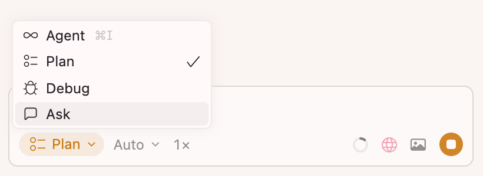
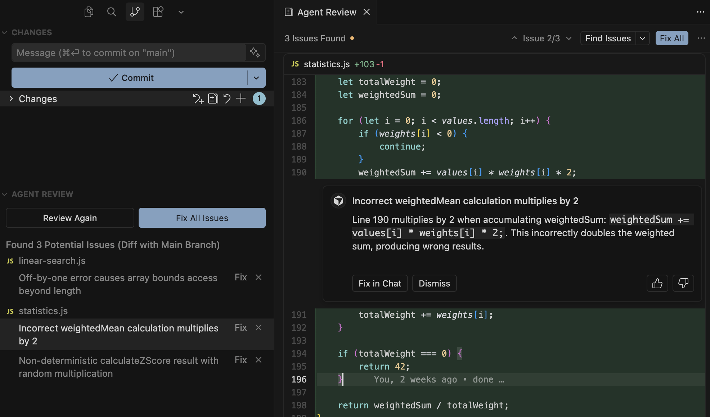

## 一些技巧
#### 计划模式（Plan Mode）

在计划模式下，Agent 不会立刻写代码，而是会：
1. 在你的代码库中检索以找到相关文件
2. 就你的需求提出澄清性问题
3. 创建详细的实现计划
4. 在开始构建前等待你的确认
> 可将计划保存在`.cursor/plans/`文件中。既可以作为团队文档，也作为后续工作上下文。
#### Agent自动查找上下文
Agent 会按需提取上下文，通过语义找到相关文件。如果知道确切的文件，可以直接@它。
#### 更具体的提示词
Agent 再收到更具体的指令时，成功率会显著提高。
尽量明确需求，参考现有模式，并说明预期结果。
#### 重新开始对话的时机
过长的对话会让 Agent 偏离重点。在这些情况下需要开启一个新的对话：
* 开始处理不同的任务或功能
* Agent 看起来反复出错
* 已经完成了一个逻辑完整的工作单元

继续当前对话的情况：
- 仍在对同一个功能迭代
- Agent 需要之前对话中的上下文
- 正在调试它构建的内容。
#### 审查迭代
Agent 在工作过程中，diff 视图可实时显示变更。
Agent 工作完成后，「review-find issues」，可做专门的审查。
#### 提供可验证目标
当 Agent 有清晰、可验证的迭代目标时，效果最好。
可以先让 Agent 编写测试，先确认这些测试是否会失败，然后再实现能通过这些测试的代码。
## 核心概念
1. **Tab**：预测代码修改的代码补全功能
2. **Agent**：在多个文件间读取和修改代码的 AI
3. **内联编辑**：使用自然语言编辑所选代码
4. **规则**：==用于定义 AI 行为的自定义指令。可设置代码规范、框架偏好和项目特点约定==
5. **语义搜索**：按含义而不是关键词查找代码
6. **MCP**：用于集成外部工具，比如数据库、API
7. **上下文**：提供给 AI 模型的信息。包括文件、会话记录等
8. **上下文窗口**：指 LLM 在一次处理中可同时考虑的最大 token 数量，其中既包含输入提示词，也包含模型生成的输出内容
## 费用
- 每天主要使用 tab 的用户：$20 以内
- 偶尔使用 Agent 的用户：$20 以内
- 每天使用 Agent 的用户：$60-$80/月
- 重度用户：$200/月
## Agent
### Agent概述
#### 工作原理
1. **指令**：用于指导 Agent 行为的系统提示词和规则
2. **工具**：文件编辑、代码库搜索、终端执行等
3. **用户消息**：用户输入的提示词和后续补充，用于指挥具体工作
> Cursor 会为每个模型专门调整指令和工具。
#### 工具
工具用于搜索代码库和网络以查找相关信息、编辑文件、运行终端命令等。
Agent 在单个任务中可发起的工具调用次数没有上限。

| 工具名称        | 描述                                                  |
| ----------- | --------------------------------------------------- |
| 语义搜索        | 在你的已索引代码库中执行语义搜索，按照含查找匹配                            |
| 搜索文件和文件夹    | 按名称搜索文件、读取目录结构，并在文件中查找精确关键词                         |
| Web         | 生成搜索语句并进行网页搜索                                       |
| 获取规则        | 根据类型和描述检索特定规则                                       |
| 读取文件        | 智能读取文件内容，支持图片文件，并将其包含在对话上下文中                        |
| 编辑文件        | 为文件提供编辑建议，并自动应用修改                                   |
| 运行 shell 命令 | 执行终端命令并查看输出                                         |
| 浏览器         | 控制浏览器进行截图、测试应用并验证界面变化。Agent 可以导航页面、与元素交互，并不会当前状态供分析 |
| 图像生成        | 根据文本描述或参考图片生成图像。适用于创建 UI 原型、产品素材以及将架构图可视化           |
| 提问          | 在任务过程中提出澄清性问题。一旦收到回答，Agent 会将其纳入任务上下文               |

#### 信息摘要
随着对话变长，cursor 会自动生成摘要并管理上下文。
使用`/summarize` 命令，手动触发内容总结。
#### Checkpoints
Checkpoints 是 Agent 针对你的代码库所做更改的自动快照，让你在需要时可撤销操作。
#### 任务队列
在 Agent 处理当前任务时，将后续消息加入队列。指令依次等待，并在就绪后自动执行。
- 任务按顺序显示
- 可以拖动进行重新排序
- 可通过发送即时消息，立即处理命令无需等待
### Agent 模式

| 模式名称  | 场景          | 能力               | 工具         |
| ----- | ----------- | ---------------- | ---------- |
| Agent | 复杂功能、重构     | 自主探索、多文件编辑       | 启用全部工具     |
| Ask   | 学习、规划、提问    | 只读探索，无自动修改       | 仅启用搜索工具    |
| Plan  | 需求规划的复杂功能   | 在执行前详细计划，提出澄清性问题 | 启用全部工具     |
| Debug | 棘手 bug、回归问题 | 生成假设、日志埋点、运行时分析  | 全部工具+调试服务器 |
#### Plan
**工作原理 ——**
1. Agent 会先提出一下澄清性问题，以了解需求
2. 分析代码库以获取上下文
3. 创建一份完整的实现计划
4. 用户可以通过聊天或 MD 文件审阅并编辑计划
5. 点击构建执行计划

> 对于较大的改动，多花些时间制定一个精确、范围清晰的计划。最难的部分往往是先弄清楚应该做什么改动 —— 这更适合由人来完成。

#### Debug
Debug 模式可以帮你查明问题根源，并修复那些难以复现或理解的棘手 bug。Agent 会先提出假设、插入日志语句，并利用其运行信息精确定位问题，进而针对性的修复。
**适用场景 ——**
- 能复现但想不明白原因的 bug
- 竞态条件和时序问题：依赖执行顺序或异步行为的问题
- 性能问题和内存泄露：需要运行时性能分析才能搞清楚的问题
- 回归问题：当需要追踪到底改了什么时

**工作原理 ——**
1. **探索并提出假设**：Agent 会探索相关文件、构建上下文，并针对潜在根因生成多个假设。
2. **添加埋点**：Agent 会添加日志语句，将数据发送到运行在 Cursor 扩展中的本地调试服务器。
3. **复现 Bug**：Debug Mode 会让你复现 Bug 并提供具体步骤。这能让你始终参与其中，并确保 Agent 捕获到真实的运行时行为。
4. **分析日志**：复现完成后，Agent 会审查收集到的日志，根据运行时证据识别真正的根因。
5. **进行针对性修复**：Agent 会执行有针对性的修复，直接处理根因——通常只需要改动几行代码。
6. **验证并清理**：你可以重新执行复现步骤来验证修复。一旦确认，Agent 会移除所有埋点。

**使用技巧 ——**
- 提供详细上下文
- 严格按照复现步骤执行
- 必要时多次复现
- 明确期望行为与实际行为
### Agent 审阅
当 Agent 生成代码更改时，这些更改会显示在一个审阅界面中。
更改差异包括：新增代码、删除代码和未更改的代码。
==Agent Review 会以专用的模式运行 Agent，专注于发现你 diff 中的缺陷。该工具会逐行分析提议的变更，并在你合并前标记潜在问题。==


**审查方式——**
- 生成完成后，会看到提示，要求在继续之前审查所有修改
- 可以接受/拒绝当前文件的修改，跳转到未处理修改的文件
- 可以选择性的接受或拒绝修改
### 终端
Agent 在终端直接运行 shell 命令，系统提供了安全的沙箱执行。命令的历史会跨会话保留。
默认情况下，Agent 会在受限环境中运行终端命令，阻止未经授权的文件访问和网络活动。命令会自动执行，并始终限制在你的工作区内。
#### 工作原理
沙盒在允许工作区操作的同事组织未授权访问：
- 文件访问：对文件系统/工作区目录的读取权限
- 网络访问：默认阻止
- 临时文件：对系统临时目录有完全访问权限
#### 配置项
- Auto-Run 模式：Agent 如何运行命令执行、MCP 和文件写入等工具。（沙盒中运行｜全部自动运行）
- Auto-Run 网络访问：沙盒是否具有网络访问权限
- 允许 Git 写入
- 命令运行列表
- MCP 运行列表
- 浏览器保护
- 文件删除保护
- 外部文件保护
### 浏览器
Agent 可以使用的浏览器工具：
- 导航
- 点击
- 输入
- 滚动
- 截图
- 控制台输出
- 网络流量
### Agent 安全性
- **一方工具调用**：内置了帮助 Agent 编写代码的工具：读取文件、编辑文件、运行终端命令、搜索网页等。
	- 其中读取文件和搜索代码不需要审批。
	- 终端命令默认需要批准
- **第三方工具调用**：所有 MCP 连接都需要批准。
- **网络请求**：Cursor 只会向以下目标发起请求：GitHub、直接链接检索、web 搜索服务商
### ⭐️Hooks
借助 hooks，你可以：
- 在编辑后运行代码格式化工具
- 为事件添加分析统计
- 扫描敏感个人信息（PII）或机密数据
- 为高风险操作加上门控（例如 SQL 写入）
- 控制 subagent（Task 工具）的执行
- 在会话开始时注入上下文

> 项目级的 hook 只对该项目生效，主目录中的 hook 会在全局生效。
> 执行 hook 的优先级顺序（从高到低）：企业 → 团队 → 项目 → 用户
#### Agent标准hooks
- `sessionStart` / `sessionEnd` - 会话生命周期管理
- `preToolUse` / `postToolUse` / `postToolUseFailure` - 通用工具使用 hooks（对所有工具生效）
- `subagentStart` / `subagentStop` - Subagent（Task 工具）生命周期
- `beforeShellExecution` / `afterShellExecution` - 控制 shell 命令执行
- `beforeMCPExecution` / `afterMCPExecution` - 控制 MCP 工具的使用
- `beforeReadFile` / `afterFileEdit` - 控制文件访问和编辑
- `beforeSubmitPrompt` - 在提交前校验 prompt
- `preCompact` - 观察上下文窗口压缩过程
- `stop` - 处理 agent 结束
- `afterAgentResponse` / `afterAgentThought` - 跟踪 agent 的响应
#### Tab标准hooks
- `beforeTabFileRead` - 控制用于 Tab 补全的文件访问
- `afterTabFileEdit` - 对 Tab 编辑结果进行后处理
#### Hook类型
* 基于命令：执行 shell 脚本，从标准输入接收 JSON，并通过标准输出返回 JSON
* 基于提示词：使用 LLM 来评估自然语言条件
## 上下文
### 规则
- **项目规则**：受版本控制，作用范围限定在当前代码库中
- **用户规则**：在整个 Cursor 环境中生效，由 Agent 使用
	- ==适合用了设定首选的交流风格或代码规范==
- **团队规则**：在控制台集中管理的团队规则
- ==AGENT.md：以 markdown 格式编写的 Agent 指令==
#### 工作原理
规则在提示级别提供持久、可复用的上下文。
应用后，规则内容会被加到模型上下文的开头。
#### 项目规则
项目规则以 markdown 文件形式存放，并纳入版本控制。规则可以通过路径模式限定作用范围，可手动触发，或根据相关性自动引入。
==使用项目规则可以：==
- 沉淀与代码库相关的领域知识
- 自动化项目特点的工作流或模板
- 统一风格或架构决策

每条规则都是一个带有 frontmatter 元数据和正文内容的 markdown 文件。
==规则应用的方式有 4 种：==
-  always apply：应用于每个聊天会话
- apply intelligently：当 Agent 根据描述判断其相关时应用（语义匹配）
- apply to specific files：当文件匹配指定模式时应用（规则匹配）
- apply manually：在对话中被提及时应用（指定匹配）

#### ⭐️最佳实践
好的规则应当聚焦、可操作且范围明确。
只有在你发现 Agent 反复犯同一个错误时再添加规则。在真正理解自己的模式之前，不要过度优化。
* 将规则控制在 500 行以内
* 将较大的规则拆分为多个可组合的规则
* 提供具体示例或参考文件
* 避免模糊的指导，像写清晰的内部文档那样写规则
* ==在聊天中重复使用提示时，复用已有规则==
* ==通过引用文件而不是复制其内容来使用文件==
#### 规则中应避免的
* 整篇照搬风格指南。Agent 已经了解场景的风格约定
* 逐条记录所有可能的命令：Agent 已知道npm、git 等场景工具
* 为极少出现的边缘情况添加说明：让规则聚焦在你经常使用的模式上
* 重复你代码库中已有的内容：引用标准示例，而不是复制代码
#### 规则文件格式
* frontmatter 元数据用于控制如何应用该规则
* 正文内容是规则本身

```
---
description: "This rule provides standards for frontend components and API validation"
alwaysApply: false
---
...rest of the rule content
```

#### AGENT.md
`AGENTS.md` 是一个用于定义 agent 指令的简单 markdown 文件。将它放在项目根目录中，作为 `.cursor/rules` 的替代选项，适用于简单直接的用例。
==`AGENTS.md` 是一个没有元数据或复杂配置的纯 markdown 文件。对于只需要简单、易读指令，而不想引入结构化规则额外负担的项目来说，它是理想选择。==
也支持在子目录中使用嵌套的`AGENTS.md` 文件，这样可以根据当前在代码库中所处的区域，更精细的控制 Agent 指令。

```
# Project Instructions
## Code Style
- Use TypeScript for all new files
- Prefer functional components in React
- Use snake_case for database columns

## Architecture
- Follow the repository pattern
- Keep business logic in service layers
```

### 命令
自定义命令运行创建可复用的工作流，并通过简单的/前缀触发。
命令以普通 markdown 文件形式定义，可存放在项目、全局和团队的目录中。

```
.cursor/
└── commands/
    ├── address-github-pr-comments.md
    ├── code-review-checklist.md
    ├── create-pr.md
    ├── light-review-existing-diffs.md
    ├── onboard-new-developer.md
    ├── run-all-tests-and-fix.md
    ├── security-audit.md
    └── setup-new-feature.md
```
#### 最佳实践

```
# 设置新功能

## 概述
从初始规划到实现结构,系统化地设置新功能。

## 步骤
1. **定义需求**
   - 明确功能范围和目标
   - 确定用户故事和验收标准
   - 规划技术方案
1. **创建功能分支**
   - 从 main/develop 创建分支
   - 设置本地开发环境
   - 配置新的依赖项
1. **规划架构**
   - 设计数据模型和 API
   - 规划 UI 组件和流程
   - 考虑测试策略

## 功能设置检查清单
- [ ] 需求已记录
- [ ] 用户故事已编写
- [ ] 技术方案已规划
- [ ] 功能分支已创建
- [ ] 开发环境已就绪
```


```
# 安全审计

## 概述
全面的安全审查,用于识别和修复代码库中的漏洞。

## 步骤
1. **依赖项审计**
   - 检查已知漏洞
   - 更新过时的包
   - 审查第三方依赖项
1. **代码安全审查**
   - 检查常见漏洞
   - 审查身份验证/授权
   - 审计数据处理实
1. **基础设施安全**
   - 审查环境变量
   - 检查访问控制
   - 审计网络安全

## 安全检查清单
- [ ] 依赖项已更新且安全
- [ ] 无硬编码密钥
- [ ] 已实现输入验证
- [ ] 身份验证安全
- [ ] 授权已正确配置
```

### Agent Skills
Skills 将特定领域的知识和工作流封装起来，智能体可以调用这些 Skills 来执行特定任务。
#### 技能的特征
- 可移植：适用于任何支持 Agent Skills 标准的 Agent
- 受版本控制： 以文件形式促成你，可以在代码仓库中追踪其变更
- 可执行：可以包含脚本和代码，由 Agent 执行以完成任务支持使用任何语言编写）
- 渐进式：技能按需加载资源，使上下文使用更加高效
#### 工作原理
 Cursor 启动时，自动从技能目录中发现并加载技能，并将它们提供给 agents 使用。Agent 会看到所有可用技能，并根据当前上下文决定合适调用它们。
 
 **目录结构 ——**
 * `scripts/`：Agents 可以运行的可执行代码
 * `references/`：按需加载的附加文档
 * `assets/`：模板、图片或数据文件等静态资源
```
.cursor/
└── skills/
    └── deploy-app/
        ├── SKILL.md
        ├── scripts/
        │   ├── deploy.sh
        │   └── validate.py
        ├── references/
        │   └── REFERENCE.md
        └── assets/
            └── config-template.json
```

**SKILL.md 文件格式 ——**
```
---
name: my-skill
description: 简要描述此技能的功能及使用时机。
---

# 我的技能
为 Agent 提供的详细指令。

## 使用时机
- 在以下情况使用此技能...
- 此技能适用于...

## 指令
- 为 Agent 提供的分步指导
- 特定领域的约定
- 最佳实践和模式
- 如需向用户澄清需求,请使用提问工具
```

### 语义搜索
语义搜索是通过理解代码的含义来查找代码，而不仅仅是进行文本匹配。
> Agent 会同时使用 grep 和语义搜索。grep 擅长查找精确模式，语义搜索删除查找在概念上相似的代码。
#### 工作原理
1. 工作区文件会安全的同步到 Cursor 服务器，以确保索引始终是最新的
2. 文件会被拆分成有意义的代码库，尽量按函数、类和逻辑代码快来划分，而不是随意文本片段
3. 每个代码库都会通过 AI 模型转换为向量表示，生成一个数字层面的“指纹”，用来捕捉代码的语义含义
4. 这些嵌入向量会存储在专门的向量数据库中，该数据库针对在数百万代码块中进行快速相似度搜索进行了优化。
5. 当你搜索时，你的查询会通过处理代码时使用的同一套 AI 模型转换为向量。
6. 系统会将你的查询向量与已存储的嵌入向量进行比较，找到最相似的代码块。
7. 你会得到带有文件位置和上下文的相关代码片段，并按与搜索请求的语义相似度排序显示。
#### 技术优势
- 更快的结果：计算发生在索引阶段（离线）而不是运行时，因此 Agent 搜索更快且成本更低
- 更高的准确性：经过定制训练的模型比字符串匹配能检索到更相关的结果
- 更少的后续交互：用户需要发生的澄清信息更少，消耗的 token 更少
- 概念机匹配：按“代码在做什么”查找，而不仅仅通过名字查找
#### 同步规则
1. 初始化：首次打开工作区时，会自动开始建立索引。
2. 保持同步：Cursor 会通过每隔 5 分钟的定期检查，自动保持你的索引与工作区同步。
### MCP
MCP 可以让 Cursor 连接到外部工具和数据源。
MCP 服务器通过协议暴露功能，使 Cursor 能连接到外部工具或数据源。
#### 协议支持
- **Tools**：供 AI 模型执行的函数
- **Prompts**：面向用户的消息模板和工作流
- **Resources**：可读取和引用的结构化数据源
- **Roots**：服务器发起的 URI 或文件系统边界查询
- **Elicitation**：服务器发起的向用户请求更多信息的操作
## 最佳实践
### 测试驱动开发 TDD
当代理拥有清晰的迭代目标时，表现最佳。测试正好能提供这一点——一个代理可以围绕其不断迭代并加以验证的目标。

**TDD 工作流 ——**
1. **让 Agent 编写测试**，基于预期的输入/输出对。要明确说明你在使用 TDD，这样它就会避免为尚不存在的功能创建模拟实现。
2. **让 Agent 运行测试并确认测试失败。** 明确说明在这个阶段不要编写实现代码。
3. **当你对测试满意时，提交这些测试。**
4. **让 Agent 编写能通过测试的代码**，并指示它不要修改测试。告诉它持续迭代，直到所有测试都通过。
5. **当你对改动满意时，提交实现代码。**
### 长时间运行的Agent循环
使用 hooks，可以创建长时间运行的 Agent，让其不断迭代，直到达成目标。
这种模式适用于：
- 反复运行并修复，直到测试通过
- 不断迭代 UI，指导与设计稿完全匹配
- 任何结果可验证的目标导向任务
### 设计转代码
- 简单设计：粘贴截图、拖入设计文件或提供图片路径
- 复杂设计：使用 FigmaMCP 直接拉取设计数据
### 为任务选择合适的工具
| **Tool**        | **Use case** | **Strength**   | **Limitation** |
| --------------- | ------------ | -------------- | -------------- |
| **Tab**         | 快速、手动修改      | 完全掌控，速度快       | 单文件            |
| **Inline Edit** | 在单个文件中局部修改   | 聚焦某一处代码进行精细编辑  | 单文件            |
| **Chat**        | 较大、多文件的修改    | 自动收集上下文，支持深度编辑 | 较慢、依赖上下文       |
**适合的场景 ——**
- 当你想亲自掌控、进行快捷修改时，用 tab
- 当你要对某一段特定代码做集中、精确修改时，用 Inline Edit
- 当你需要理解更多上下文、进行大范围改动时，用chat

**要点总结 ——**
- 缩小每次修改的范围，不要一次尝试太多
- 尽量提供相关上下文
- 经常新建对话
- 用 ask 模式做规划，用 Agent 模式来实现
### Mermaid 图表
架构图可以用了梳理逻辑、跟踪数据，并清晰表达架构。
- 从明确的目标开始
	- **流程/控制流**： “告诉我请求如何从控制器流向数据库。”
	- **数据沿袭**： “从进入到最终落点，追踪这个变量的路径。”
	- **结构**： “给我这个服务的组件级视图。”
- 可以指定起点和终点，或让 Cursor 查找完整路径
- 从小处着手，类似 C4 模型。先从较低层级开始，再逐步上移到更高层级的概览
