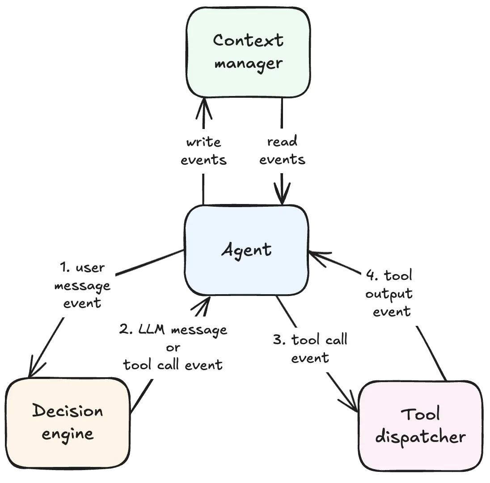
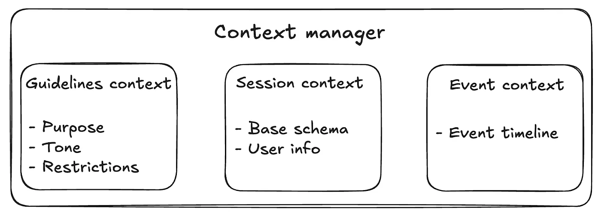

**简单 AI 功能的局限：** 在需要动态决策、检索预先提供数据之外的信息的问题时，无法进行推理。
### Agent 架构

Agent 需要能够记住信息、执行预定义的操作，以及自主决策完成用户请求所需的操作。Agent 架构是异步事件驱动的状态机。
Agent 消费事件，将这些事件写入上下文管理器，然后为该事件触发相应的处理程序。它负责在 Agent 循环中保持事务的“持续进行”。将从用户的初始提示到最终响应的完整事件循环称之为一次“交互”。

Agent 消费和传递的主要事件类型如下：
1. **用户消息事件**：由用户向交互中发送消息而产生的。会==触发决策引擎==调用 LLM 来决定下一步要采取的步骤
2. **工具调用事件**：是当 LLM 决定运行工具来完成用户请求时，由决策引擎产生的。这里会==触发工具分发器==
3. **工具调用输出事件**：是由工具分发器在完成工具执行时发生的，这里会再次==触发决策引擎==调用 LLM
4. **LLM** **消息事件**：当 LLM 产生最终输出信息时，由决策引擎产生的。这会==结束 Agent 循环==
#### 上下文管理器

Agent 的行为由其所给予的上下文驱动。上下文代表 Agent 能够看到、操纵和在决策过程中使用的“世界”。Agent 使用不同类型的上下文：
- **指南上下文**：用户为自定义 Agent 行为而指定的说明，包括 Agent 的目的、语气或限制
- **会话上下文**：==包含与当前基础和当前用户相关的信息==
    - **基础上下文**相对静态，与当前工作区内所有用户都相关，比如表格、单元格、界面和页面
    - **用户上下文**包括仅限当前用户的内容，比如用户信息、角色权限和当前浏览页面
- 事件上下文：当 Agent 循环中的事件被触发时，它们会被添加到上下文管理器。这些事件有两个目的：一是被 Agent 消费以决定 Agent 循环的下一步；二是维护交互历史纪录，将其呈现给用户
#### 决策引擎
是 Agent 的“大脑”，从上下文管理器中获取所有上下文，并决策在Agent循环中的下一步操作。==通过 LLM、HITL或固定工作流来控制。==每当它被调用时，都会执行以下步骤：
1. ==将上下文序列化为LLMAPI标准格式==
    1. User message：终端用户触发的消息，例如用户侧的事件上下文
    2. Assistant message：供应商生成的消息，例如供应商侧的事件上下文
    3. System message：顶级指令，比如指南和会话上下文
2. 调用 LLM API
3. 解析响应。如果 LLM 调用工具，则发起工具调用事件；否则，发出包含最终响应的 LLM 消息事件
#### 工具调度器
运行决策引擎请求的工具。当工具调用完成运行时，工具调度器向 Agent 发送工具调用输出事件。根据 Agent 的目的，工具调度器公开不同的预定义工具。
为了确保 Agent 循环能够自我修正、用户能够理解失败原因。工具返回要包含以下错误信息：

- 错误是否可重试；如果不可重试，则结束 Agent 循环
- 如果错误重试，向决策引擎暴露有效信息
- 用户可见的错误消息
大多数情况下，通过描述性的错误信息，LLM 可以自我纠正并使用不同的参数重试工具调用，或向用户说明请求失败的原因。
### 处理大型上下文
- **修剪：**
    - 截断工具响应
    - 删除旧消息
    - 筛选基础模式（数据库）：删除无关 ID、为必要 ID 创建别名、删除列、删除表
- **摘要总结：** 利用每个 LLM 调用都有自己的上下文窗口，将用户请求的处理并行化到多个调用中，然后将结果聚合成一个连贯的总结
